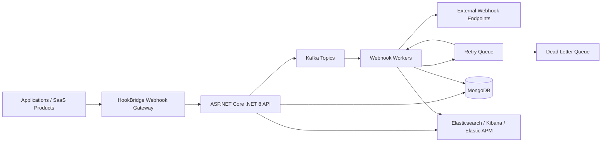

# HookBridge

HookBridge is an open-source high-throughput webhook platform built using .NET 8, Kafka, MongoDB, and Kubernetes.

It provides scalable webhook processing, retry mechanisms, DLQ handling, CloudEvents compatibility, and enterprise-grade observability.

[](https://github.com/skm00/HookBridge/actions/workflows/dotnet-ci.yml)
[](https://dotnet.microsoft.com/download/dotnet/8.0)
[](#license)
[](https://github.com/skm00/HookBridge/stargazers)
[](https://github.com/skm00/HookBridge/network/members)
[](https://kafka.apache.org/)
[](https://cloudevents.io/)
[](https://www.docker.com/)
[](deploy/helm/README.md)
[](.github/SECURITY.md)
[](https://github.com/sponsors/skm00)

## GitHub Search Metadata

**Repository About description:** High-throughput webhook processing platform built with .NET 8, Kafka, MongoDB, Kubernetes, and CloudEvents support.

**Optimized GitHub Topics:** `dotnet`, `aspnetcore`, `webhook`, `webhook-platform`, `kafka`, `mongodb`, `kubernetes`, `event-driven`, `cloud-native`, `microservices`, `cloudevents`, `observability`, `elasticsearch`, `distributed-systems`.


⭐ **If you find HookBridge useful, please star the repository.**

## Table of Contents

- [Webhook Platform Overview](#webhook-platform-overview)
- [Why HookBridge?](#why-hookbridge)
- [Features](#features)
- [Architecture](#architecture)
- [Technology Stack](#technology-stack)
- [Retry & DLQ](#retry--dlq)
- [AI Analysis Kafka Topic](#ai-analysis-kafka-topic)
- [CloudEvents Support](#cloudevents-support)
- [Observability](#observability)
- [Kubernetes Deployment](#kubernetes-deployment)
- [Docker Setup](#docker-setup)
- [Getting Started](#getting-started)
- [Continuous Integration](#continuous-integration)
- [Roadmap](#roadmap)
- [Sponsors](#sponsors)
- [Contributing](#contributing)
- [Use Cases](#use-cases)
- [Scaling and Reliability](#scaling-and-reliability)
- [Screenshots](#screenshots)
- [API Documentation](#api-documentation)
- [Repository Layout](#repository-layout)
- [Configuration and Operations](#configuration-and-operations)
- [Community and Support](#community-and-support)
- [License](#license)

## Webhook Platform Overview

HookBridge provides a production-oriented **webhook platform** and **webhook gateway** for teams that need to ingest events, buffer traffic, process delivery asynchronously, retry failures, and inspect delivery history without relying on a third-party hosted webhook SaaS.

The project is a **.NET 8 webhook system** and **.NET webhook** foundation built around ASP.NET Core APIs, Kafka webhook processing, MongoDB persistence, CloudEvents support, Docker, Kubernetes deployment assets, and Elastic observability. HookBridge is designed for **scalable webhook processing** in an **event-driven architecture** where webhook delivery must survive endpoint downtime, traffic bursts, duplicate messages, and operational failures.

Use HookBridge when you need a self-hosted foundation for:

- A central webhook gateway in front of multiple products or tenants.
- Kafka webhook processing for burst buffering and async delivery.
- A webhook retry mechanism with fixed or exponential retry behavior.
- A dead letter queue for failed webhook events and manual replay workflows.
- Webhook observability across API ingestion, worker delivery, failures, and health.
- CloudEvents support for interoperable event-driven platform integrations.

## Why HookBridge?

Direct webhook delivery is simple at low volume, but it becomes difficult to operate when downstream endpoints are slow, unavailable, or inconsistent. HookBridge adds infrastructure patterns that make webhook delivery more reliable and observable.

| Capability | Direct webhook delivery | HookBridge webhook platform |
| --- | --- | --- |
| Direct delivery | Application sends HTTP requests immediately from business code. | API accepts events and workers deliver webhooks asynchronously. |
| Retry support | Usually ad hoc, duplicated across services, or missing. | Built-in webhook retry mechanism with persisted delivery attempts. |
| Kafka buffering | No buffer; traffic spikes can overload application threads. | Kafka webhook processing decouples ingestion from delivery throughput. |
| DLQ support | Failures are often only logs or dropped events. | Dead letter queue records failed events after retry exhaustion. |
| Observability | Requires custom logging in every service. | Webhook observability via health checks, structured logs, Elasticsearch, Kibana, and Elastic APM. |
| Scalability | Scaling requires changing every producer service. | Scale API, Kafka, MongoDB, and worker components independently. |
| CloudEvents support | Event formats vary across teams. | CloudEvents support helps standardize event metadata and payloads. |

## Features

- **High-throughput webhook ingestion** through an ASP.NET Core API with tenant API keys and validation.
- **Kafka webhook processing** that buffers inbound events and decouples producers from outbound webhook delivery.
- **Scalable webhook processing workers** for delivery, retry, cleanup, and failed-event recovery workflows.
- **Webhook retry mechanism** with persisted delivery attempts, response metadata, fixed retry behavior, exponential retry behavior, and manual replay support.
- **Dead letter queue handling** through failed-event records after retry exhaustion.
- **CloudEvents support** for CloudEvents v1.0 structured payloads and binary-style HTTP headers.
- **Webhook observability** using structured logs, health endpoints, Elasticsearch, Kibana, and Elastic APM support.
- **MongoDB persistence** for tenants, events, subscriptions, attempts, audit logs, notifications, failed events, and configuration.
- **Endpoint validation and outbound security** for target URLs, reserved headers, authentication settings, payload limits, HMAC signatures, API keys, OAuth2 client credentials, and Basic authentication.
- **Multi-tenant administration** with JWT-backed admin APIs, roles, tenant API keys, IP allowlists, and rate limiting.
- **Docker and Kubernetes deployment** with Docker Compose for local development and Helm chart assets for Kubernetes environments.
- **Developer-friendly APIs** with Swagger/OpenAPI documentation, Postman examples, Thunder Client examples, and demo data.

## Architecture

HookBridge separates ingestion, event streaming, webhook delivery, retry/DLQ handling, persistence, and observability. This event-driven architecture lets producers submit events quickly while workers handle delivery reliability outside the request path.



### Core Runtime Flow

1. A producer sends an event to the HookBridge API through the webhook gateway.
2. The API validates tenant credentials, endpoint configuration, event shape, and optional CloudEvents metadata.
3. Accepted events are persisted and published into Kafka for Kafka webhook processing.
4. Worker consumers deliver events to subscribed webhook endpoints.
5. Delivery attempts are recorded with status code, duration, response details, and error metadata.
6. Transient failures enter the webhook retry mechanism.
7. Exhausted failures are stored in the dead letter queue for inspection and replay.
8. Logs, traces, health checks, and delivery state power webhook observability.

For deeper design notes, see [Architecture Documentation](docs/architecture.md).

## Technology Stack

| Layer | Technology |
| --- | --- |
| API and webhook gateway | .NET 8, ASP.NET Core, Swagger/OpenAPI |
| Event streaming | Apache Kafka, Confluent.Kafka |
| Persistence | MongoDB |
| Background processing | .NET Worker Service, Kafka consumers, retry workers, cleanup workers, AI worker |
| Event format | CloudEvents v1.0 structured and binary-style HTTP support |
| Observability | Serilog, health checks, Elasticsearch, Kibana, Elastic APM |
| Dashboard | React/Vite dashboard assets |
| Local runtime | Docker Compose |
| Cloud runtime | Kubernetes, Helm |
| Security | JWT admin auth, tenant API keys, roles, IP allowlists, endpoint validation, outbound auth options |

## Agentic AI Worker

`HookBridge.AI.Worker` is a .NET 8 Worker Service for future Agentic AI background processing. It runs separately from the API and webhook delivery workers so AI-related jobs can evolve without affecting ingestion or delivery throughput.

The worker registers Microsoft Semantic Kernel through `AddAiKernelServices()` and builds kernels with `IKernelFactory`/`SemanticKernelFactory`. When `AI:Enabled` is `true`, startup validates the complete `AI` options section and verifies that a Semantic Kernel instance can be created from configuration. When `AI:Enabled` is `false`, Semantic Kernel initialization is skipped safely and the worker logs that AI is disabled. The default development configuration targets Ollama, while production disables AI by default:

```json
{
  "AI": {
    "Enabled": true,
    "Provider": "Ollama",
    "Model": "llama3",
    "Endpoint": "http://localhost:11434",
    "TimeoutSeconds": 30,
    "MaxRetries": 3,
    "SystemPrompt": "You are HookBridge AI, an assistant for webhook failure analysis and event processing.",
    "EnablePromptLogging": false,
    "EnableFallback": true,
    "LlmRequestTimeoutSeconds": 30,
    "MaxFallbackSummaryLength": 1000,
    "HealthCheckPrompt": "Say HookBridge AI is ready",
    "MaxPromptPayloadLength": 4000,
    "MaskSensitiveValues": true,
    "MaxLogEntriesForSummary": 100,
    "MaxLogMessageLength": 2000
  }
}
```

AI options can be set with environment variables such as `AI__Enabled`, `AI__Provider`, `AI__Model`, `AI__Endpoint`, `AI__TimeoutSeconds`, `AI__MaxRetries`, `AI__SystemPrompt`, `AI__EnablePromptLogging`, `AI__EnableFallback`, `AI__LlmRequestTimeoutSeconds`, `AI__MaxFallbackSummaryLength`, `AI__HealthCheckPrompt`, `AI__MaxPromptPayloadLength`, `AI__MaskSensitiveValues`, `AI__MaxLogEntriesForSummary`, and `AI__MaxLogMessageLength`. Prompt logging is disabled by default and should remain disabled in production unless explicitly approved for short-lived diagnostics.

Webhook failure analysis DTOs, prompt templates, and the AI retry recommendation service define the sanitized request/response contracts used by LLM processing. The prompt builder converts failure context into strict JSON instructions, masks sensitive headers by default, truncates large payloads with `AI:MaxPromptPayloadLength`, and asks for AI summaries, root-cause guidance, risk levels, confidence, and retry recommendations. `IAiRetryRecommendationService` validates model JSON, normalizes metadata, applies safety overrides such as never retrying `429` immediately, and falls back to deterministic rule-based recommendations with fallback metadata when AI is disabled, unavailable, timed out, missing a model, or returns invalid/empty JSON; see the [AI retry recommendation service documentation](docs/ai-worker.md#ai-retry-recommendation-service) for the fallback decision table and example payloads.

AI log summarization is also available through `IAiLogSummarizationService` for debugging and support workflows. It turns webhook-related log entries into a concise JSON response with summary, likely root cause, impact, recommendation, risk level, confidence, model, and provider metadata. `AiLogSummaryPromptBuilder` builds deterministic strict-JSON prompts, masks sensitive values (`Authorization`, `Cookie`, `Set-Cookie`, `Token`, `Secret`, `Password`, `Api-Key`, `X-API-Key`, and `ConnectionString`), truncates large messages with `AI:MaxLogMessageLength`, and limits prompt size with `AI:MaxLogEntriesForSummary`. When AI is disabled, logs are empty, the LLM is unavailable, or model JSON is invalid, the service falls back to a rule-based summary that counts errors/warnings, selects the most recent error as likely root cause, and returns a lower-confidence safe recommendation. See [AI Worker documentation](docs/ai-worker.md#ai-log-summarization-service) for example request/response payloads and safety behavior.

Endpoint health scoring is available through `IEndpointHealthScoringService` for deterministic webhook target reliability scoring. It starts from `100`, subtracts capped penalties for failure rate, timeouts, HTTP `429`, `5xx`, `4xx`, retry count, average/P95 latency, dead-letter records, and recent failures, clamps the result to `0..100`, maps scores to `Healthy`, `Degraded`, `Unhealthy`, `Critical`, or `Unknown`, and maps those statuses to `AiRiskLevel`. The service is pure and testable with in-memory DTOs only; see the [endpoint health scoring documentation](docs/ai-worker.md#endpoint-health-scoring-service) for the formula, thresholds, validation rules, and example request/response payloads.


Run it locally with:

```bash
dotnet run --project src/HookBridge.AI.Worker/HookBridge.AI.Worker.csproj
```

Ensure Ollama is available at `http://localhost:11434`, or override the endpoint and model with environment variables:

```bash
AI__Enabled=true \
AI__Provider=Ollama \
AI__Model=llama3 \
AI__Endpoint=http://localhost:11434 \
AI__TimeoutSeconds=30 \
AI__MaxRetries=3 \
AI__EnablePromptLogging=false \
AI__EnableFallback=true \
AI__LlmRequestTimeoutSeconds=30 \
AI__MaxFallbackSummaryLength=1000 \
AI__MaxPromptPayloadLength=4000 \
AI__MaskSensitiveValues=true \
AI__MaxLogEntriesForSummary=100 \
AI__MaxLogMessageLength=2000 \
dotnet run --project src/HookBridge.AI.Worker/HookBridge.AI.Worker.csproj
```

See [AI Worker documentation](docs/ai-worker.md) for the full configuration table, fallback decision table, example fallback response, how to disable fallback, production recommendation, environment variable examples, Semantic Kernel usage, Ollama model examples, retry recommendation behavior, and MongoDB AI result storage settings.

## Retry & DLQ

HookBridge includes a webhook retry mechanism that records every delivery attempt and keeps failed delivery state visible to operators.

- Events are accepted through the API and published for worker processing.
- The worker records delivery attempts, response status, duration, target URL, and errors.
- Retry policies can use fixed or exponential behavior depending on subscription configuration.
- Failed events are persisted in a DLQ-style failed-events collection after retry exhaustion.
- Admin APIs and dashboard pages support failed-event inspection and manual retry.

This webhook retry mechanism and dead letter queue model improves reliability for event-driven webhook processing because temporary endpoint outages do not require producers to re-send business events manually.


## Customer Endpoint Risk Score

HookBridge AI Worker includes a deterministic Customer Endpoint Risk Score for webhook endpoint operations. The score does not call an LLM; it starts at `0`, adds bounded risk points for failure rate, retries, max-retry exhaustion, dead-letter records, timeouts, HTTP `429`, `4xx`, `5xx`, authentication and signature failures, suspicious payload indicators, elevated latency, and recent failures, then clamps the final value to `0-100`.

Risk thresholds are `0-20 = Low / Healthy`, `21-50 = Medium / Degraded`, `51-80 = High / Unhealthy`, `81-100 = Critical / Critical`, and `Unknown` when there are no deliveries in the evaluation window. Results are stored in MongoDB collection `customer_endpoint_risk_score_results` and can be produced from Kafka topic `hookbridge.ai.endpoint-risk-score`. See [AI Worker documentation](docs/ai-worker.md#customer-endpoint-risk-score) for example request and response payloads.

## CloudEvents Support

HookBridge provides CloudEvents support for CloudEvents v1.0 structured payloads and binary-style HTTP requests, making it easier to integrate with event-driven architecture standards across services and platforms.

Supported ingestion styles include raw JSON, HookBridge envelopes, and CloudEvents payloads:

```json
{ "username": "abc" }
```

```json
{
  "eventType": "invoice.created",
  "payload": { "invoiceId": "INV-001" }
}
```

```json
{
  "specversion": "1.0",
  "id": "evt_123",
  "source": "/example",
  "type": "invoice.created",
  "data": { "invoiceId": "INV-001" }
}
```

For CloudEvents binary-style requests, provide attributes such as `ce-specversion`, `ce-id`, `ce-source`, `ce-type`, and optional `ce-time` as HTTP headers. `CloudEvents.type` maps to the HookBridge event type. If no event type is present, HookBridge uses `default`. Subscription matching supports exact event types, `*`, and empty event type values as wildcards.

Strict CloudEvents validation can be enabled with configuration:

```bash
CloudEvents__StrictValidation=true
```

## AI Analysis Kafka Topic

HookBridge AI analysis events use Kafka topic `hookbridge.ai.analysis`. Detected AI anomaly events use Kafka topic `hookbridge.ai.anomalies`. The topic is consumed by `HookBridge.AI.Worker` for asynchronous webhook failure analysis and event enrichment workflows. The worker binds Kafka settings from the `AiKafka` section, including `BootstrapServers`, `SecurityProtocol`, `SaslMechanism`, `SaslUsername`, `SaslPassword`, `AiAnalysisTopic`, `AnomaliesTopic`, `ConsumerGroupId`, and `EnableAutoCommit`. AI analysis results are persisted to MongoDB using the `AiMongo` section, with the default collection names `ai_analysis_results` and `ai_anomaly_records` for compact anomaly records. See [HookBridge AI Worker docs](docs/ai-worker.md#kafka-ai-analysis-topic) for the example message payload and local Kafka test command, and [MongoDB AI analysis result storage](docs/ai-worker.md#mongodb-ai-analysis-result-storage) for the required MongoDB configuration, anomaly record search filters, indexes, duplicate handling behavior, and example stored documents.

## Observability

Webhook observability is a first-class part of HookBridge. Local Docker Compose includes Elasticsearch, Kibana, and Elastic APM so teams can inspect ingestion, delivery behavior, retries, failures, and service health.

Useful local endpoints and tools:

- `/health`
- `/api/v1/health/*`
- Kibana: <http://localhost:5601>
- Elastic APM Server: <http://localhost:8200>

Observability data can include structured application logs, worker logs, delivery attempts, response metadata, audit logs, failed events, and health status. This gives operators the information needed to investigate webhook gateway failures, dead letter queue growth, downstream outages, latency spikes, and retry storms.

## Kubernetes Deployment

HookBridge includes Helm/Kubernetes deployment assets for teams that want to run scalable webhook infrastructure in a cloud-native environment. Use these assets as a starting point for Kubernetes webhook deployment across staging and production clusters.

- Helm chart documentation: [`deploy/helm/README.md`](deploy/helm/README.md)
- Deployment notes: [`docs/deployment.md`](docs/deployment.md)
- Environment sample: [`deploy/.env.example`](deploy/.env.example)
- Docker Compose reference: [`deploy/docker-compose.yml`](deploy/docker-compose.yml)

A typical Kubernetes deployment separates the API, worker, Kafka, MongoDB, and observability components so each layer can scale independently. Production deployments should configure ingress, TLS, secrets, resource requests/limits, persistent storage, Kafka retention, MongoDB backups, and Elastic retention policies.

## Docker Setup

The fastest way to run the full local webhook platform is Docker Compose. It starts MongoDB, Kafka, Elasticsearch, Kibana, Elastic APM, the HookBridge API, the worker, and the dashboard.

```bash
docker compose -f deploy/docker-compose.yml up --build
```

### Local Service URLs

| Service | URL |
| --- | --- |
| API | <http://localhost:5000> |
| Swagger UI | <http://localhost:5000/swagger> |
| Dashboard | <http://localhost:3000> |
| MongoDB | `mongodb://localhost:27017` |
| Kafka | `localhost:9092` |
| Elasticsearch | <http://localhost:9200> |
| Kibana | <http://localhost:5601> |
| Elastic APM Server | <http://localhost:8200> |

### Demo Credentials

Development configuration enables demo seed data by default:

- Admin email: `demo@hookbridge.local`
- Admin password: `DemoPassword123!`
- Demo tenant slug: `demo-company`

For guided walkthroughs and examples, see:

- [`docs/demo.md`](docs/demo.md)
- [`docs/api-examples.md`](docs/api-examples.md)
- [`docs/postman/hookbridge.postman_collection.json`](docs/postman/hookbridge.postman_collection.json)
- [`docs/thunder-client/hookbridge.json`](docs/thunder-client/hookbridge.json)

### Stop Docker Services

```bash
docker compose -f deploy/docker-compose.yml down
```

Remove local MongoDB and Elasticsearch volumes as well:

```bash
docker compose -f deploy/docker-compose.yml down -v
```

## Getting Started

Start locally with Docker Compose for the complete webhook platform, or use the .NET SDK when developing API and worker services directly.

### Prerequisites

- Docker and Docker Compose v2.
- Git.
- [.NET 8 SDK](https://dotnet.microsoft.com/download/dotnet/8.0) if running services outside Docker.
- Node.js 18+ if working on the dashboard.

### Clone the Repository

```bash
git clone https://github.com/skm00/HookBridge.git
cd HookBridge
```

### Restore, Build, and Test

```bash
dotnet restore
dotnet build HookBridge.sln
dotnet test HookBridge.sln

# Run AI Worker unit tests and collect Coverlet XPlat coverage
dotnet test tests/HookBridge.AI.Worker.Tests/HookBridge.AI.Worker.Tests.csproj \
  --configuration Release \
  --no-build \
  --collect:"XPlat Code Coverage" \
  --settings coverlet.runsettings \
  --results-directory ./TestResults/Unit

# Run AI Worker integration tests with coverage. Omit this command locally when
# you need the same behavior as SKIP_INTEGRATION_TESTS=true in CI.
dotnet test tests/HookBridge.AI.Worker.IntegrationTests/HookBridge.AI.Worker.IntegrationTests.csproj \
  --configuration Release \
  --no-build \
  --collect:"XPlat Code Coverage" \
  --settings coverlet.runsettings \
  --results-directory ./TestResults/Integration

# Generate the gated HTML, Cobertura XML, and Markdown coverage report from
# deterministic AI Worker unit coverage. Integration coverage remains available
# under TestResults/Integration for diagnostics, but it is not merged into the
# threshold gate because it intentionally boots a broad end-to-end host.
dotnet tool install --global dotnet-reportgenerator-globaltool
reportgenerator \
  -reports:"TestResults/Unit/**/coverage.cobertura.xml" \
  -targetdir:"CoverageReport" \
  -reporttypes:"Html;Cobertura;MarkdownSummaryGithub;TextSummary"
```

## Continuous Integration

HookBridge uses the [`.NET CI/CD`](.github/workflows/dotnet-ci.yml) GitHub Actions workflow to validate changes before they are merged into `main`. The workflow runs on every pull request targeting `main` and every push to `main` using `ubuntu-latest` with the .NET 8 SDK.

The pipeline provides:

- **Build validation:** restores NuGet packages once, builds `HookBridge.sln` in `Release` mode, and fails fast when compilation fails.
- **Automated testing:** runs the existing API, application, worker, AI Worker unit, and AI Worker integration xUnit test projects with `dotnet test --no-build`, emits TRX logs, and surfaces failing test names in the GitHub Actions log output. The AI Worker integration test stage runs by default; repository maintainers can set `SKIP_INTEGRATION_TESTS=true` as a GitHub Actions variable when an emergency skip is needed.
- **Code coverage:** collects Coverlet `XPlat Code Coverage` for the AI Worker unit and integration test stages. The gated ReportGenerator summary is produced from deterministic AI Worker unit coverage, enforces at least 80% line coverage and 70% branch coverage, and publishes `CoverageReport/` as the `hookbridge-coverage-report` workflow artifact. Integration coverage remains available in the uploaded `TestResults/Integration` artifact for diagnostics without diluting the unit coverage gate with broad end-to-end host startup paths.
- **Coverage visibility:** appends the ReportGenerator Markdown summary to the GitHub Actions job summary, including line and branch coverage totals. Open the completed workflow run, download `hookbridge-coverage-report`, and view `index.html` locally for the readable HTML report or `Cobertura.xml` for tooling integrations.
- **Pull request checks:** uploads `TestResults/` on every run and is designed to be required as a status check before merging.
- **Fast execution:** caches NuGet packages and uses `--no-restore`/`--no-build` to avoid duplicate work after the initial restore and build steps.

Recommended branch protection for `main`:

1. Require a pull request before merging.
2. Require the `.NET CI/CD` status check to pass before merge so build, test, the 80% line coverage gate, and the 70% branch coverage gate cannot be bypassed.
3. Prevent direct pushes to `main`, including for administrators unless an emergency bypass process is documented.
4. Require branches to be up to date before merging when the repository has high commit volume.

## Roadmap

Near-term roadmap items:

- Harden Kafka topic management and retry/DLQ operational tooling.
- Expand OpenAPI examples and SDK/client generation guidance.
- Add more Kubernetes deployment documentation for ingress, TLS, secrets, production observability, and sizing.
- Improve dashboard workflows for delivery history, endpoint validation, and DLQ replay.
- Add more integration tests around Kafka, MongoDB, worker retry behavior, CloudEvents support, and duplicate-safe delivery.
- Document production scaling, consumer lag monitoring, retention tuning, and operational runbooks.

The roadmap is intentionally conservative and implementation-driven. Issues and pull requests should prefer small, verifiable improvements over broad rewrites.

## Sponsors

HookBridge is actively maintained, and community support, feedback, and sponsorships help improve long-term development. Sponsorship helps fund documentation, CI reliability, test coverage, dependency maintenance, demos, and long-term issue triage.

[Sponsor HookBridge on GitHub](https://github.com/sponsors/skm00)

For sponsorship messaging and maintainer notes, see [`docs/sponsorship.md`](docs/sponsorship.md).

## Contributing

⭐ **If you find HookBridge useful, please star the repository.**

Contributions are welcome. Please keep changes focused, documented, and covered by tests where possible.

Recommended workflow:

1. Fork the repository and create a feature branch.
2. Run `dotnet restore`, `dotnet build HookBridge.sln`, and `dotnet test HookBridge.sln` before opening a pull request.
3. For dashboard changes, run `npm install`, `npm run typecheck`, and `npm run build` from `src/HookBridge.Dashboard`.
4. Update README/docs when behavior, configuration, APIs, or deployment steps change.
5. Keep pull requests small enough to review comfortably.

Good first contribution areas include documentation fixes, test coverage, API examples, dashboard usability improvements, deployment notes, and validation edge cases.

For detailed contribution guidelines, see [`CONTRIBUTING.md`](CONTRIBUTING.md).

## Use Cases

HookBridge is useful for teams building or operating:

- A self-hosted webhook platform for SaaS products.
- A .NET 8 webhook system for internal or customer-facing integrations.
- A Kafka webhook processing pipeline for bursty event delivery.
- A webhook gateway that centralizes retries, DLQ handling, and webhook observability.
- A CloudEvents .NET event ingestion layer for event-driven architecture adoption.
- A scalable webhook infrastructure layer for microservices and cloud-native platforms.
- A developer portal or dashboard for tenants, subscriptions, delivery history, and failed-event replay.

## Scaling and Reliability

HookBridge is designed for scalable webhook processing and reliable delivery in distributed systems.

### Kafka Consumer Swap Buffer Strategy

The worker includes a production-oriented swap-buffer Kafka consumer for high-throughput webhook ingestion. It is designed for traffic bursts where Kafka messages must be consumed quickly while MongoDB writes are persisted in efficient batches for webhook audit logs, delivery history, retry queue persistence, DLQ event storage, and observability ingestion.

The consumer keeps the Kafka polling path lightweight by appending each deserialized event to an in-memory primary buffer. When the batch size reaches 500 records, the flush interval reaches 5 seconds, or the worker shuts down, the primary and secondary buffers are swapped under a short lock. MongoDB persistence then runs against the swapped batch so Kafka consumption can continue without awaiting every database write.

MongoDB writes use unordered `InsertManyAsync` batches with a unique event identifier index. The unordered batch lets MongoDB continue inserting valid records when one replayed event hits a duplicate key, while the unique event identifier requirement makes Kafka at-least-once delivery duplicate-safe.

Kafka auto commit is disabled. The worker commits offsets only after MongoDB persistence succeeds, and it commits the highest processed offset per topic partition. If MongoDB fails, offsets are not committed, allowing Kafka to replay the records. If MongoDB succeeds but the offset commit fails, replayed messages are ignored safely by the unique event identifier constraint.

Backpressure is handled without Channels or `BlockingCollection`: if MongoDB is still flushing and the active primary buffer reaches `MaxBufferSize`, the worker pauses assigned Kafka partitions and resumes them after the flush completes.

### Reliability Practices

- Decouple event ingestion from outbound delivery with Kafka.
- Persist delivery attempts and failures for auditability.
- Use MongoDB unique identifiers to tolerate Kafka replay.
- Pause Kafka partitions when persistence falls behind.
- Run multiple API and worker replicas when deployed to Kubernetes.
- Monitor retry volume, DLQ growth, target endpoint latency, and consumer lag.
- Use backups, retention policies, and cleanup workers to manage operational data.

## Screenshots

Screenshots are intentionally provided as placeholders until the dashboard UI stabilizes.

| Area | Placeholder |
| --- | --- |
| Dashboard overview | `docs/images/dashboard-overview.png` |
| Webhook delivery logs | `docs/images/delivery-logs.png` |
| Dead letter queue | `docs/images/dead-letter-queue.png` |
| Observability dashboard | `docs/images/observability.png` |

Add screenshots under `docs/images/` as the UI and operations workflows mature.

## API Documentation

HookBridge publishes Swagger/OpenAPI documentation in development:

- Swagger UI: <http://localhost:5000/swagger>
- OpenAPI JSON: <http://localhost:5000/swagger/v1/swagger.json>

Swagger includes versioned API documentation and auth schemes for:

- Bearer JWT admin APIs under `/api/v1/admin/...`
- Tenant event ingestion with `x-api-key`
- AI analysis lookup at `GET /api/ai-analysis/events/{eventId}` for retrieving stored webhook failure analysis results by EventId
- Public auth, billing webhook, and health endpoints

Export the OpenAPI document locally:

```bash
curl http://localhost:5000/swagger/v1/swagger.json -o swagger.v1.json
```

Additional API examples are available in [`docs/api.md`](docs/api.md) and [`docs/api-examples.md`](docs/api-examples.md).

### Example AI Analysis Lookup

```bash
curl http://localhost:5000/api/ai-analysis/events/evt_12345
```

A successful response contains the stored AI summary, root cause, recommendation, retry action, risk level, confidence score, model, provider, and creation timestamp. The endpoint returns `200 OK` when a result exists, `400 Bad Request` for an empty or invalid EventId, `404 Not Found` when no analysis exists, and `500 Internal Server Error` only for unexpected retrieval errors.

### Example Ingestion Request

```bash
curl -X POST http://localhost:5000/api/v1/events/{tenantId} \
  -H "Content-Type: application/json" \
  -H "x-api-key: {tenant-api-key}" \
  -d '{"eventType":"invoice.created","payload":{"invoiceId":"INV-001"}}'
```

## Repository Layout

```text
src/
  HookBridge.Api/             ASP.NET Core API, Swagger/OpenAPI, auth, ingestion, admin endpoints
  HookBridge.Application/     Application services, validation, DTOs, use cases
  HookBridge.Domain/          Domain entities and enums
  HookBridge.Infrastructure/  MongoDB, Kafka, persistence, logging, external integrations
  HookBridge.Shared/          Shared API contracts and helpers
  HookBridge.Worker/          Kafka consumers, delivery worker, retry worker, cleanup worker
tests/                        API, application, and worker tests
deploy/                       Docker Compose, environment samples, Helm chart
docs/                         API examples, demo guide, deployment, security, backup/restore
```

### Docker Images

HookBridge packages are published on GitHub Container Registry (GHCR):

| Component | Image |
| --- | --- |
| API | `ghcr.io/skm00/hookbridge-api:latest` |
| Worker | `ghcr.io/skm00/hookbridge-worker:latest` |
| Dashboard | `ghcr.io/skm00/hookbridge-dashboard:latest` |

## Configuration and Operations

### API Versioning

- Current stable version: `v1`
- Route format: `/api/v{version}/...`
- Examples:
  - `/api/v1/events/{tenantId}`
  - `/api/v1/admin/subscriptions`
  - `/api/v1/admin/failed-events/{id}/retry`

### Authentication Model

- Admin APIs use Bearer JWTs.
- Event ingestion uses the tenant API key header: `x-api-key`.
- Admin roles include Owner, Admin, Developer, and Viewer.
- API keys can be restricted by exact IP addresses or CIDR ranges.

### Endpoint Validation and Outbound Authentication

Subscription endpoints support validation for:

- HTTP/HTTPS target URLs.
- Development-only private network URL allowances.
- Reserved or unsafe headers.
- Authentication configuration.
- Payload and response-size limits.

Outbound webhook authentication options include:

- Basic authentication.
- API key header.
- OAuth2 client credentials.
- HMAC signatures.

### Production Configuration Checklist

HookBridge fails fast for critical production configuration. Production deployments should provide, at minimum:

- MongoDB connection string and database name.
- Kafka bootstrap servers and consumer group settings.
- JWT issuer, audience, secret, and expiry.
- Stripe billing secrets and price IDs if billing is enabled.
- Elastic service metadata and URLs when Elastic sinks/APM are enabled.
- Encryption master key of at least 32 characters.

Development allows empty Stripe secrets so the local API can start without a billing account. `Stripe:SuccessUrl` and `Stripe:CancelUrl` are still required.

### Data Retention, Cleanup, and Rate Limiting

Development defaults include automated cleanup windows for incoming events, delivery logs, failed events, audit logs, and notifications. The worker hosts the cleanup job, so run the worker when testing retention behavior.

Development rate limits are enabled by default:

- Event ingestion: 100 requests per 60 seconds.
- Admin API: 300 requests per 60 seconds.

Rate limits are partitioned by relevant caller context and return standard throttling responses when exceeded.

### Dashboard Routes

Public routes include `/`, `/pricing`, `/docs`, `/docs/quickstart`, `/docs/events`, `/docs/subscriptions`, `/docs/authentication`, `/docs/retries`, `/docs/errors`, `/login`, and `/register`.

Protected dashboard routes include `/overview` and operational pages for tenants, subscriptions, events, delivery logs, billing, settings, health, audit logs, notifications, and failed events.

### Operations References

- Docker Compose: [`deploy/docker-compose.yml`](deploy/docker-compose.yml)
- Environment sample: [`deploy/.env.example`](deploy/.env.example)
- Helm chart: [`deploy/helm/README.md`](deploy/helm/README.md)
- Deployment notes: [`docs/deployment.md`](docs/deployment.md)
- Security notes: [`docs/security.md`](docs/security.md)
- Backup and restore: [`docs/backup-restore.md`](docs/backup-restore.md)

## Community and Support

- **Issues:** Use GitHub Issues for reproducible bugs, focused feature requests, documentation gaps, and actionable maintenance tasks.
- **Discussions:** Use GitHub Discussions for architecture questions, deployment tradeoffs, community support, and ideas that need design feedback.
- **Security reporting:** Do not report vulnerabilities in public issues or discussions. Review [`docs/security.md`](docs/security.md) and [`.github/SECURITY.md`](.github/SECURITY.md).
- **Support policy:** See [`.github/SUPPORT.md`](.github/SUPPORT.md).

## License

A license file has not been committed yet. Before using HookBridge in production or redistributing modified versions, confirm the intended license with the project maintainer or add an explicit license file to the repository.

---

⭐ **If you find HookBridge useful, please star the repository and share it with others.**

### AI Payload Schema Detection

HookBridge AI Worker can consume schema detection events from `hookbridge.ai.schema-detection`, inspect incoming webhook JSON payloads, and persist results to MongoDB collection `payload_schema_detection_results`. The Payload Schema Detection Agent identifies likely schema and event names, summarizes payload structure, extracts important fields, reports missing fields or quality issues, suggests a DTO name, and records confidence/risk metadata.

The agent is safe by default: prompts mask `Authorization`, `Cookie`, `Set-Cookie`, `Token`, `Secret`, `Password`, `Api-Key`, `X-API-Key`, `ClientSecret`, and `AccessToken` values and truncate large payloads. If AI is disabled, the LLM is unavailable, the payload is invalid JSON, or the LLM returns invalid JSON, deterministic fallback uses `System.Text.Json` to infer root object/array structure and basic field types without requiring Ollama, Kafka, or MongoDB in unit tests. See [`docs/ai-worker.md`](docs/ai-worker.md#payload-schema-detection-agent) for request/response examples.

## JSON-to-DTO Suggestion Agent

HookBridge AI Worker includes a JSON-to-DTO Suggestion Agent that analyzes a webhook JSON payload and suggests clean C# DTO classes for integrations. The agent can use the configured local LLM when AI is enabled, but it always has a deterministic rule-based fallback so unit tests and local development do not require Ollama, Kafka, or MongoDB.

### Example request

```json
{
  "eventId": "evt_1001",
  "correlationId": "corr_2001",
  "eventType": "OrderCreated",
  "source": "HookBridge.API",
  "customerId": "cust_001",
  "rootClassName": "OrderCreatedDto",
  "namespace": "HookBridge.Contracts.Events",
  "payload": {
    "orderId": "ORD-1001",
    "status": "Created",
    "totalAmount": 129.50,
    "createdAt": "2026-05-14T10:30:00Z",
    "customer": {
      "id": "C001",
      "name": "Test Customer"
    },
    "items": [
      {
        "sku": "SKU-001",
        "quantity": 2
      }
    ]
  },
  "receivedAtUtc": "2026-05-14T10:30:00Z"
}
```

### Example response

```json
{
  "eventId": "evt_1001",
  "correlationId": "corr_2001",
  "suggestedRootClassName": "OrderCreatedDto",
  "namespace": "HookBridge.Contracts.Events",
  "generatedCode": "using System.Text.Json.Serialization;\n\nnamespace HookBridge.Contracts.Events;\n\npublic sealed class OrderCreatedDto { ... }",
  "classes": [
    {
      "className": "OrderCreatedDto",
      "properties": [
        {
          "propertyName": "OrderId",
          "jsonName": "orderId",
          "cSharpType": "string",
          "isNullable": true,
          "isRequired": true,
          "description": "Mapped from JSON property 'orderId'."
        }
      ],
      "description": "DTO generated for OrderCreatedDto."
    }
  ],
  "summary": "Generated DTO classes from webhook payload.",
  "validationNotes": [],
  "confidenceScore": 0.86,
  "riskLevel": "Low",
  "generatedAtUtc": "2026-05-14T10:31:00Z",
  "model": "llama3",
  "provider": "Ollama",
  "fallback": {
    "usedFallback": false,
    "fallbackReason": "None"
  }
}
```

### Example generated DTO code

```csharp
using System.Text.Json.Serialization;

namespace HookBridge.Contracts.Events;

public sealed class OrderCreatedDto
{
    [JsonPropertyName("orderId")]
    public string? OrderId { get; set; }

    [JsonPropertyName("status")]
    public string? Status { get; set; }

    [JsonPropertyName("totalAmount")]
    public decimal TotalAmount { get; set; }

    [JsonPropertyName("createdAt")]
    public DateTime CreatedAt { get; set; }

    [JsonPropertyName("customer")]
    public CustomerDto? Customer { get; set; }

    [JsonPropertyName("items")]
    public List<OrderCreatedItemDto>? Items { get; set; }
}

public sealed class CustomerDto
{
    [JsonPropertyName("id")]
    public string? Id { get; set; }

    [JsonPropertyName("name")]
    public string? Name { get; set; }
}

public sealed class OrderCreatedItemDto
{
    [JsonPropertyName("sku")]
    public string? Sku { get; set; }

    [JsonPropertyName("quantity")]
    public int Quantity { get; set; }
}
```

### Fallback behavior

The agent uses deterministic fallback generation when AI is disabled, the LLM is unavailable, the payload is invalid JSON, or the LLM returns invalid JSON. The fallback parses payloads with `System.Text.Json`, infers basic C# types (`string`, `int`, `long`, `decimal`, `bool`, `DateTime`, `List<T>`, `object`, and `JsonElement`), generates nested classes for nested objects, and derives the root class name from `eventType` when no `rootClassName` is provided. Fallback responses use lower confidence scores and include fallback metadata and validation notes.

### Security and masking

Prompts mask sensitive values before sending payload context to the LLM and truncate large payloads safely. The masking rules cover `Authorization`, `Cookie`, `Set-Cookie`, `Token`, `Secret`, `Password`, `Api-Key`, `X-API-Key`, `ClientSecret`, and `AccessToken`. The worker logs structured metadata only, never full payloads or generated code. DTO code contains property declarations and JSON names only; it does not embed sample values or secrets.

The Kafka topic for DTO suggestion events is `hookbridge.ai.dto-suggestion`, and MongoDB results are stored in the `json_to_dto_suggestion_results` collection.

### AI Webhook Transformation Recommendations

HookBridge AI Worker includes a Webhook Transformation Recommendation Agent that compares a source webhook payload with a target schema or sample payload and recommends human-reviewed transformation mappings. The worker consumes `hookbridge.ai.transformation-recommendation`, stores results in MongoDB collection `webhook_transformation_recommendation_results`, masks sensitive values before prompt creation, and falls back to deterministic field-name matching when AI is disabled or unavailable. See [docs/ai-worker.md](docs/ai-worker.md#webhook-transformation-recommendation-agent) for request/response examples, generated code guidance, fallback behavior, and security rules.

### Webhook failure anomaly detection

The AI worker includes deterministic webhook failure anomaly detection for sudden spikes in delivery failure rate, retries, dead-letter records, HTTP 429 rate limits, timeouts, HTTP 4xx/5xx errors, authentication failures, signature validation failures, suspicious payloads, and average/P95 latency. This score is rule-based and does not require Ollama or any LLM.

The detector compares the current metric window to a baseline window, adds deterministic score impacts for breached thresholds, and clamps `anomalyScore` from `0` to `100`. `isAnomalyDetected` becomes `true` at score `>= 25`. Risk levels map to `Low` for `0-20`, `Medium` for `21-50`, `High` for `51-80`, `Critical` for `81-100`, and `Unknown` when current or baseline delivery data is insufficient.

Primary thresholds are: failure rate, retry count, timeout count, rate-limit count, client error count, server error count, average latency, and P95 latency increases of at least `50%`; dead-letter and authentication increases of at least `25%`; signature validation and suspicious payload counts increasing by at least `1` from a zero baseline.

Results are stored in MongoDB collection `webhook_failure_anomaly_detection_results`, compact anomaly records are stored in `ai_anomaly_records`, and the worker consumes requests from Kafka topic `hookbridge.ai.failure-anomalies`. When a detected result has `isAnomalyDetected: true`, HookBridge publishes a compact anomaly notification to Kafka topic `hookbridge.ai.anomalies` for downstream alerting and incident workflows.

Anomaly detection tests live in `tests/HookBridge.AI.Worker.Tests`, with reusable JSON metric fixtures in `tests/HookBridge.AI.Worker.Tests/TestData/AnomalyDetection`. Run them with:

```bash
dotnet test tests/HookBridge.AI.Worker.Tests/HookBridge.AI.Worker.Tests.csproj --filter "FullyQualifiedName~Anomaly"
```

The repository coverage workflow continues to enforce at least 80% line coverage and 70% branch coverage for unit coverage runs. Integration tests that require MongoDB or Kafka Testcontainers should remain isolated from unit tests and must not be required for deterministic anomaly service, mapper, producer, consumer, or repository unit coverage.

Detected anomaly notifications are also persisted as compact documents in MongoDB collection `ai_anomaly_records`. The collection supports querying by `customerId`, `customerIdType`, `subscriptionId`, `endpointId`, `environment`, `eventType`, `anomalyType`, `riskLevel`, anomaly score range, and `createdAtUtc` time range. Results are sorted by newest first and paginated. The worker creates indexes for those fields plus compound indexes for `customerId + createdAtUtc`, `endpointId + createdAtUtc`, and `riskLevel + createdAtUtc`. `anomalyId` is unique; duplicate anomaly events return a duplicate repository result and are logged as warnings rather than inserted twice.

Example anomaly event payload:

```json
{
  "anomalyId": "anm_1001",
  "eventId": "evt_12345",
  "correlationId": "corr_789",
  "customerId": "cust_123",
  "customerIdType": "MDM",
  "subscriptionId": "sub_456",
  "endpointId": "endpoint_789",
  "targetUrl": "https://customer.example.com/webhook",
  "environment": "qa",
  "eventType": "OrderCreated",
  "anomalyType": "RateLimitSpike",
  "riskLevel": "High",
  "anomalyScore": 78,
  "summary": "HTTP 429 rate-limit failures increased sharply compared to the baseline window.",
  "recommendation": "Reduce concurrency and retry with exponential backoff.",
  "source": "HookBridge.AI.Worker",
  "createdAtUtc": "2026-05-14T10:16:30Z"
}
```

Create the local Kafka anomaly topic:

```bash
docker exec -it kafka kafka-topics \
  --create \
  --if-not-exists \
  --topic hookbridge.ai.anomalies \
  --bootstrap-server kafka:9092 \
  --partitions 3 \
  --replication-factor 1
```

Consume local anomaly events:

```bash
docker exec -it kafka kafka-console-consumer \
  --bootstrap-server kafka:9092 \
  --topic hookbridge.ai.anomalies \
  --from-beginning \
  --property print.key=true
```

## AI Security Analysis

HookBridge AI Security Analysis inspects webhook payloads, headers, source metadata, and delivery context for advisory security review. It is designed to flag suspicious events before replay or forwarding, store the analysis in MongoDB, and publish suspicious findings to the AI anomalies stream for downstream review workflows.

> **Important:** AI Security Analysis is advisory. Do not automatically block production traffic solely from an AI or fallback score. Use the suggested action to guide human review and operational runbooks.

### Kafka and MongoDB

- Kafka input topic: `hookbridge.ai.security-analysis`
- Optional suspicious-event anomaly topic: `hookbridge.ai.anomalies`
- MongoDB collection: `ai_security_analysis_results`

### Security scoring rules

The deterministic fallback scanner starts at `0` and clamps the final `securityRiskScore` to `0..100`:

| Signal | Score impact |
| --- | ---: |
| Signature validation failure | +30 |
| Authentication failure | +30 |
| Payload size greater than `AI:LargePayloadThresholdBytes` | +15 |
| Script/XSS-like content (`<script`, `javascript:`) | +20 |
| SQL injection-like content (`DROP TABLE`, `UNION SELECT`) | +25 |
| Command injection-like content (`cmd.exe`, `/bin/sh`, `powershell`) | +30 |
| Path traversal (`../`, `..\\`) | +20 |
| Secret-looking values (`Bearer `, `password`, `client_secret`, `access_token`) | +15 |
| Suspicious or missing User-Agent | +10 |

### Risk levels and suggested actions

| Score | Risk level | Typical suggested action |
| ---: | --- | --- |
| 0-20 | Low | Allow or Monitor |
| 21-50 | Medium | Monitor |
| 51-80 | High | RequireManualReview or Quarantine |
| 81-100 | Critical | Quarantine or Reject |

Signature validation or authentication failures never recommend `Allow`. Suggested actions are advisory and include `None`, `Allow`, `Monitor`, `RequireManualReview`, `Quarantine`, `BlockTemporarily`, and `Reject`.

### Configuration

```json
{
  "AI": {
    "MaxSecurityPayloadLength": 4000,
    "LargePayloadThresholdBytes": 1048576,
    "EnableSecurityAnalysisFallback": true
  }
}
```

`MaxSecurityPayloadLength` truncates prompt payload context safely, `LargePayloadThresholdBytes` controls the large-payload fallback signal, and `EnableSecurityAnalysisFallback` keeps deterministic scanning available when AI is disabled, unavailable, or returns invalid JSON.

### Example request

```json
{
  "eventId": "evt_1001",
  "correlationId": "corr_2001",
  "customerId": "cust_123",
  "subscriptionId": "sub_456",
  "environment": "qa",
  "source": "HookBridge.API",
  "eventType": "OrderCreated",
  "targetUrl": "https://customer.example.com/webhook",
  "httpMethod": "POST",
  "sourceIp": "10.10.10.10",
  "userAgent": "unknown-client",
  "signatureValidationFailed": true,
  "authenticationFailed": false,
  "payloadSizeBytes": 2048,
  "payload": {
    "orderId": "ORD-1001",
    "comment": "<script>alert('x')</script>"
  },
  "receivedAtUtc": "2026-05-14T10:30:00Z"
}
```

### Example response

```json
{
  "eventId": "evt_1001",
  "correlationId": "corr_2001",
  "isSuspicious": true,
  "securityRiskScore": 60,
  "riskLevel": "High",
  "summary": "Detected 3 deterministic webhook security signal(s).",
  "recommendation": "Quarantine the event and perform manual security review before replaying or forwarding.",
  "detectedSecuritySignals": [
    {
      "signalName": "SignatureValidationFailed",
      "severity": "High",
      "description": "The webhook signature validation failed.",
      "evidence": "signatureValidationFailed=true",
      "recommendation": "Verify signing secret and timestamp tolerance."
    }
  ],
  "suggestedAction": "Quarantine",
  "confidenceScore": 0.6,
  "generatedAtUtc": "2026-05-14T10:31:00Z",
  "model": "llama3",
  "provider": "Ollama",
  "fallback": {
    "usedFallback": true,
    "fallbackReason": "AiDisabled",
    "fallbackMessage": "AI is disabled; deterministic security scanning was used.",
    "provider": "Ollama",
    "model": "llama3",
    "generatedAtUtc": "2026-05-14T10:31:00Z"
  }
}
```

- [Webhook duplicate/replay detection](docs/duplicate-replay-detection.md) documents deterministic fingerprinting, scoring, MongoDB collection, and Kafka topic details.

## AI Dashboard Summary API

HookBridge exposes an AI dashboard summary endpoint for operational UI cards and charts.
The endpoint aggregates stored AI analysis results, anomaly records, security findings, customer endpoint risk scores, retry recommendations, endpoint health buckets, and recent findings without exposing webhook payloads, headers, secrets, or tokens.

### Endpoint

```http
GET /api/ai-dashboard/summary
```

### Query parameters

| Parameter | Description |
| --- | --- |
| `environment` | Optional environment filter, for example `qa`, `staging`, or `production`. |
| `customerId` | Optional customer identifier filter. |
| `customerIdType` | Optional customer identifier type filter. |
| `subscriptionId` | Optional subscription identifier filter. |
| `endpointId` | Optional endpoint identifier filter. |
| `eventType` | Optional webhook event type filter. |
| `fromUtc` | Optional inclusive UTC range start. Must be UTC when supplied. |
| `toUtc` | Optional exclusive UTC range end. Must be UTC and greater than `fromUtc` when supplied. |

When `fromUtc` and `toUtc` are omitted, HookBridge uses the configured default lookback window of the last 24 hours. The date range is capped at 90 days by default.

### Dashboard options

```json
{
  "AiDashboard": {
    "DefaultLookbackHours": 24,
    "MaxLookbackDays": 90,
    "RecentFindingsLimit": 20
  }
}
```

### Example request

```http
GET /api/ai-dashboard/summary?environment=qa&customerId=cust_123&fromUtc=2026-05-14T00:00:00Z&toUtc=2026-05-14T23:59:59Z
```

### Example response

```json
{
  "environment": "qa",
  "customerId": "cust_123",
  "fromUtc": "2026-05-14T00:00:00Z",
  "toUtc": "2026-05-14T23:59:59Z",
  "totalAiAnalyses": 1250,
  "totalAnomalies": 42,
  "totalSecurityFindings": 8,
  "totalHighRiskEndpoints": 12,
  "totalRetryRecommendations": 315,
  "totalDeadLetterRecommendations": 27,
  "averageConfidenceScore": 0.82,
  "riskDistribution": {
    "unknown": 5,
    "low": 920,
    "medium": 230,
    "high": 80,
    "critical": 15
  },
  "anomalyTypeDistribution": [
    {
      "name": "RateLimitSpike",
      "count": 18,
      "percentage": 42.86
    }
  ],
  "retryActionDistribution": [
    {
      "name": "RetryWithBackoff",
      "count": 315,
      "percentage": 72.5
    }
  ],
  "endpointHealthDistribution": [
    {
      "name": "Healthy",
      "count": 40,
      "percentage": 60.6
    },
    {
      "name": "Unhealthy",
      "count": 12,
      "percentage": 18.18
    }
  ],
  "recentFindings": [
    {
      "id": "66460f4f9f1e2a5a12345678",
      "eventId": "evt_12345",
      "correlationId": "corr_789",
      "customerId": "cust_123",
      "subscriptionId": "sub_456",
      "endpointId": "endpoint_789",
      "findingType": "Anomaly",
      "title": "Rate limit spike detected",
      "summary": "HTTP 429 responses increased sharply.",
      "riskLevel": "High",
      "suggestedAction": "RetryWithBackoff",
      "createdAtUtc": "2026-05-14T10:16:30Z"
    }
  ],
  "generatedAtUtc": "2026-05-14T10:30:00Z"
}
```

### Metrics explanation

- `totalAiAnalyses`, `totalAnomalies`, and `totalSecurityFindings` count stored AI outputs in the selected time window.
- `totalHighRiskEndpoints` counts endpoint risk-score records classified as `High` or `Critical`.
- `totalRetryRecommendations` counts AI analysis retry actions such as `RetryImmediately` and `RetryWithBackoff`.
- `totalDeadLetterRecommendations` counts AI analysis actions that recommend moving the event to the dead-letter queue.
- `averageConfidenceScore` combines non-zero confidence averages from AI failure and security analysis sources.
- `riskDistribution`, `anomalyTypeDistribution`, `retryActionDistribution`, and `endpointHealthDistribution` power dashboard charts.
- `recentFindings` returns the most recent AI analysis, anomaly, and security findings, capped internally by `RecentFindingsLimit`.

## AI Natural Language Query Endpoint

HookBridge exposes a safe natural language investigation endpoint for users and administrators who need quick answers about webhook failures, anomalies, retry recommendations, endpoint risk, endpoint health, and security findings.

### Endpoint

```http
POST /api/ai/query
Content-Type: application/json
```

### Example questions

- Why are my webhook deliveries failing?
- Show high-risk endpoints in QA.
- Why did event `evt_12345` fail?
- Which customers have the most anomalies today?
- Show recent HTTP 429 failures.
- What should I retry?
- Which events should move to dead letter?
- Summarize security issues for customer `cust_123`.

### Example request

```json
{
  "query": "Why are webhook deliveries failing for customer cust_123 in QA today?",
  "environment": "qa",
  "customerId": "cust_123",
  "fromUtc": "2026-05-14T00:00:00Z",
  "toUtc": "2026-05-14T23:59:59Z",
  "maxResults": 20
}
```

Optional filters include `environment`, `customerId`, `customerIdType`, `subscriptionId`, `endpointId`, `eventId`, `correlationId`, `fromUtc`, `toUtc`, and `maxResults`. When no date range is supplied, HookBridge uses the last 24 hours. `maxResults` defaults to 20 and is capped at 100.

### Example response

```json
{
  "query": "Why are webhook deliveries failing for customer cust_123 in QA today?",
  "answer": "Most failures are related to HTTP 429 rate limiting and timeout responses. Retry with exponential backoff is recommended, and delivery concurrency should be reduced for the affected endpoint.",
  "intent": "FailureAnalysis",
  "filtersUsed": {
    "environment": "qa",
    "customerId": "cust_123",
    "fromUtc": "2026-05-14T00:00:00Z",
    "toUtc": "2026-05-14T23:59:59Z",
    "maxResults": 20
  },
  "results": [
    {
      "id": "66460f4f9f1e2a5a12345678",
      "eventId": "evt_12345",
      "correlationId": "corr_789",
      "customerId": "cust_123",
      "subscriptionId": "sub_456",
      "endpointId": "endpoint_789",
      "resultType": "FailureAnalysis",
      "title": "HTTP 429 rate limit failure",
      "summary": "Target endpoint returned Too Many Requests.",
      "riskLevel": "Medium",
      "suggestedAction": "RetryWithBackoff",
      "createdAtUtc": "2026-05-14T10:16:30Z"
    }
  ],
  "suggestedActions": [
    "Retry with exponential backoff.",
    "Reduce delivery concurrency for the affected endpoint.",
    "Review repeated failures before replaying dead-letter events."
  ],
  "confidenceScore": 0.82,
  "generatedAtUtc": "2026-05-14T10:30:00Z",
  "model": "llama3",
  "provider": "Ollama",
  "fallback": false
}
```

### Safety rules and limitations

- User text is never converted into arbitrary MongoDB queries.
- AI-generated database queries are never executed.
- The endpoint reads through predefined repository methods and returns redacted DTOs, not Mongo entities.
- AI can summarize and recommend only; it does not execute production actions directly.
- Suggested actions are advisory and should be reviewed before retries, replay, dead-letter movement, or security response.
- Prompts instruct the model not to expose secrets, headers, tokens, raw payloads, target credentials, or connection strings.
- If AI is disabled or unavailable, HookBridge returns a deterministic fallback summary based on matching repository results.

### AI Prompt Versioning

HookBridge stores AI prompt templates under `src/HookBridge.AI.Worker/Prompts/{PromptName}/{Version}.prompt.txt` and tracks `PromptName`, `PromptVersion`, and `PromptHash` on AI responses and MongoDB result documents. Active prompt versions are configured through the `AIPrompts` section, using semantic versions such as `v1.0.0`, `v1.1.0`, and `v2.0.0`. The SHA-256 prompt hash helps operators audit which prompt content produced a result and detect accidental template drift. Prompt metadata is exposed through `GET /api/ai-prompts` and `GET /api/ai-prompts/{promptName}/{version}`; prompt content is omitted unless `includeContent=true` is explicitly supplied. See [AI Worker documentation](docs/ai-worker.md#ai-prompt-versioning) for the folder structure, rollout steps, and API details.

## AI Recommendation Approval Workflow

HookBridge stores AI-generated recommendations as advisory records. AI output can help operators understand retry strategies, security risks, transformations, validation rules, DTO suggestions, anomalies, log summaries, and natural-language query findings, but **AI recommendations are advisory until a human approves them**. HookBridge AI components must never execute production actions directly.

Approval records are persisted in MongoDB collection `ai_recommendation_approvals` and include the recommendation id, event/correlation/customer/subscription/endpoint metadata, recommendation type, risk level, suggested action, summary, recommendation text, requester/reviewer metadata, UTC timestamps, and expiry metadata.

### Approval statuses

* `PendingReview` — recommendation is waiting for human review.
* `Approved` — reviewer approved the recommendation for a later controlled production action.
* `Rejected` — reviewer rejected the recommendation; it cannot be applied.
* `NeedsMoreInfo` — reviewer requested more analysis before approval or rejection.
* `Applied` — an approved recommendation was applied by an explicit non-AI production workflow.
* `Expired` — recommendation is no longer actionable.

### Valid status transitions

* `PendingReview` → `Approved`
* `PendingReview` → `Rejected`
* `PendingReview` → `NeedsMoreInfo`
* `NeedsMoreInfo` → `Approved`
* `NeedsMoreInfo` → `Rejected`
* `Approved` → `Applied`
* `PendingReview` → `Expired`
* `Approved` → `Expired`

Invalid transitions return `409 Conflict`. Rejected recommendations cannot become applied, applied recommendations cannot be changed, expired recommendations cannot be changed, and rejected recommendations cannot be changed unless a future configuration explicitly allows that behavior.

### Approval requirement rules

By default, HookBridge requires approval for high-risk recommendations, critical-risk recommendations, security recommendations, transformation recommendations, and low-risk retry recommendations. Low-risk retry recommendations can only be auto-approved when `AiRecommendationApproval:AllowLowRiskAutoApproval` is enabled. The default approval expiry is 72 hours.

### API endpoints

* `GET /api/ai-recommendations/approvals` — search approval records by customer, subscription, endpoint, recommendation type, approval status, risk level, and UTC date range.
* `GET /api/ai-recommendations/approvals/{id}` — get one approval record by id.
* `GET /api/ai-recommendations/approvals/pending` — list pending approvals.
* `POST /api/ai-recommendations/approvals` — create an advisory approval record.
* `PUT /api/ai-recommendations/approvals/{id}/status` — update approval status using a valid transition.

### Example create request

```json
{
  "recommendationId": "rec_1001",
  "eventId": "evt_12345",
  "correlationId": "corr_789",
  "customerId": "cust_123",
  "subscriptionId": "sub_456",
  "endpointId": "endpoint_789",
  "recommendationType": "RetryRecommendation",
  "riskLevel": "High",
  "suggestedAction": "RetryWithBackoff",
  "summary": "Endpoint is failing due to HTTP 429 rate limiting.",
  "recommendation": "Retry with exponential backoff and reduce concurrency.",
  "requestedBy": "HookBridge.AI.Worker"
}
```

### Example response

```json
{
  "success": true,
  "message": "AI recommendation approval created.",
  "data": {
    "id": "665000000000000000000001",
    "recommendationId": "rec_1001",
    "eventId": "evt_12345",
    "correlationId": "corr_789",
    "customerId": "cust_123",
    "subscriptionId": "sub_456",
    "endpointId": "endpoint_789",
    "recommendationType": "RetryRecommendation",
    "approvalStatus": "PendingReview",
    "riskLevel": "High",
    "suggestedAction": "RetryWithBackoff",
    "summary": "Endpoint is failing due to HTTP 429 rate limiting.",
    "recommendation": "Retry with exponential backoff and reduce concurrency.",
    "requestedBy": "HookBridge.AI.Worker",
    "reviewedBy": null,
    "reviewComment": null,
    "requiresApproval": true,
    "createdAtUtc": "2026-05-15T00:00:00Z",
    "reviewedAtUtc": null,
    "appliedAtUtc": null,
    "expiresAtUtc": "2026-05-18T00:00:00Z"
  },
  "traceId": "..."
}
```

### Example update status request

```json
{
  "approvalStatus": "Approved",
  "reviewedBy": "admin@hookbridge.local",
  "reviewComment": "Approved for controlled retry with backoff."
}
```

## AI security analysis agent tests

Security analysis agent coverage lives in `tests/HookBridge.AI.Worker.Tests` and exercises deterministic fallback rules, AI JSON parsing/fallback behavior, sensitive-data masking, repository query behavior, anomaly publishing, and DI registration for `IAiSecurityAnalysisAgent`, `IAiSecurityAnalysisPromptBuilder`, and `IAiSecurityAnalysisRepository`.

Sample payload fixtures are stored in `tests/HookBridge.AI.Worker.Tests/TestData/SecurityAnalysis/`:

- `safe-payload.json`
- `xss-payload.json`
- `sql-injection-payload.json`
- `command-injection-payload.json`
- `path-traversal-payload.json`
- `secret-looking-payload.json`
- `large-payload.json`
- `invalid-json-payload.json`

Run the focused security analysis tests with:

```bash
dotnet test tests/HookBridge.AI.Worker.Tests/HookBridge.AI.Worker.Tests.csproj --filter "FullyQualifiedName~AiSecurityAnalysis"
```

Run the full AI worker unit suite with coverage using the same collector used by CI:

```bash
dotnet test tests/HookBridge.AI.Worker.Tests/HookBridge.AI.Worker.Tests.csproj --collect:"XPlat Code Coverage"
```

Coverage remains gated at 80% line coverage and 70% branch coverage. Unit tests use Moq and deterministic fixtures, so they do not require real Ollama, Kafka, MongoDB, or Testcontainers. MongoDB and Kafka Testcontainers, when present, should remain isolated in the integration test project.

## Payload mapping recommendation tests

Payload mapping and webhook transformation recommendation coverage lives in `tests/HookBridge.AI.Worker.Tests` with deterministic JSON fixtures under `tests/HookBridge.AI.Worker.Tests/TestData/PayloadMapping/`.

Run the payload mapping focused tests with:

```bash
dotnet test tests/HookBridge.AI.Worker.Tests/HookBridge.AI.Worker.Tests.csproj --filter "FullyQualifiedName~WebhookTransformation"
```

Run the full AI worker unit suite with coverage using the same collector used by CI:

```bash
dotnet test tests/HookBridge.AI.Worker.Tests/HookBridge.AI.Worker.Tests.csproj --collect:"XPlat Code Coverage"
```

The GitHub Actions coverage gate remains 80% line coverage and 70% branch coverage. Payload mapping tests use fake LLM responses and mocked Mongo collections, so they do not require Ollama, Kafka, or a real MongoDB instance.
