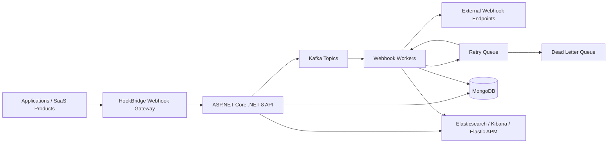

# HookBridge

HookBridge is an open-source high-throughput webhook platform built using .NET 8, Kafka, MongoDB, and Kubernetes.

It provides scalable webhook processing, retry mechanisms, DLQ handling, CloudEvents compatibility, and enterprise-grade observability.

[](https://github.com/skm00/HookBridge/actions/workflows/dotnet-ci.yml)
[](https://dotnet.microsoft.com/download/dotnet/8.0)
[](#license)
[](https://github.com/skm00/HookBridge/stargazers)
[](https://github.com/skm00/HookBridge/network/members)
[](https://kafka.apache.org/)
[](https://cloudevents.io/)
[](https://www.docker.com/)
[](deploy/helm/README.md)
[](.github/SECURITY.md)
[](https://github.com/sponsors/skm00)

## GitHub Search Metadata

**Repository About description:** High-throughput webhook processing platform built with .NET 8, Kafka, MongoDB, Kubernetes, and CloudEvents support.

**Optimized GitHub Topics:** `dotnet`, `aspnetcore`, `webhook`, `webhook-platform`, `kafka`, `mongodb`, `kubernetes`, `event-driven`, `cloud-native`, `microservices`, `cloudevents`, `observability`, `elasticsearch`, `distributed-systems`.


⭐ **If you find HookBridge useful, please star the repository.**

## Table of Contents

- [Webhook Platform Overview](#webhook-platform-overview)
- [Why HookBridge?](#why-hookbridge)
- [Features](#features)
- [Architecture](#architecture)
- [Technology Stack](#technology-stack)
- [Retry & DLQ](#retry--dlq)
- [CloudEvents Support](#cloudevents-support)
- [Observability](#observability)
- [Kubernetes Deployment](#kubernetes-deployment)
- [Docker Setup](#docker-setup)
- [Getting Started](#getting-started)
- [Continuous Integration](#continuous-integration)
- [Roadmap](#roadmap)
- [Sponsors](#sponsors)
- [Contributing](#contributing)
- [Use Cases](#use-cases)
- [Scaling and Reliability](#scaling-and-reliability)
- [Screenshots](#screenshots)
- [API Documentation](#api-documentation)
- [Repository Layout](#repository-layout)
- [Configuration and Operations](#configuration-and-operations)
- [Community and Support](#community-and-support)
- [License](#license)

## Webhook Platform Overview

HookBridge provides a production-oriented **webhook platform** and **webhook gateway** for teams that need to ingest events, buffer traffic, process delivery asynchronously, retry failures, and inspect delivery history without relying on a third-party hosted webhook SaaS.

The project is a **.NET 8 webhook system** and **.NET webhook** foundation built around ASP.NET Core APIs, Kafka webhook processing, MongoDB persistence, CloudEvents support, Docker, Kubernetes deployment assets, and Elastic observability. HookBridge is designed for **scalable webhook processing** in an **event-driven architecture** where webhook delivery must survive endpoint downtime, traffic bursts, duplicate messages, and operational failures.

Use HookBridge when you need a self-hosted foundation for:

- A central webhook gateway in front of multiple products or tenants.
- Kafka webhook processing for burst buffering and async delivery.
- A webhook retry mechanism with fixed or exponential retry behavior.
- A dead letter queue for failed webhook events and manual replay workflows.
- Webhook observability across API ingestion, worker delivery, failures, and health.
- CloudEvents support for interoperable event-driven platform integrations.

## Why HookBridge?

Direct webhook delivery is simple at low volume, but it becomes difficult to operate when downstream endpoints are slow, unavailable, or inconsistent. HookBridge adds infrastructure patterns that make webhook delivery more reliable and observable.

| Capability | Direct webhook delivery | HookBridge webhook platform |
| --- | --- | --- |
| Direct delivery | Application sends HTTP requests immediately from business code. | API accepts events and workers deliver webhooks asynchronously. |
| Retry support | Usually ad hoc, duplicated across services, or missing. | Built-in webhook retry mechanism with persisted delivery attempts. |
| Kafka buffering | No buffer; traffic spikes can overload application threads. | Kafka webhook processing decouples ingestion from delivery throughput. |
| DLQ support | Failures are often only logs or dropped events. | Dead letter queue records failed events after retry exhaustion. |
| Observability | Requires custom logging in every service. | Webhook observability via health checks, structured logs, Elasticsearch, Kibana, and Elastic APM. |
| Scalability | Scaling requires changing every producer service. | Scale API, Kafka, MongoDB, and worker components independently. |
| CloudEvents support | Event formats vary across teams. | CloudEvents support helps standardize event metadata and payloads. |

## Features

- **High-throughput webhook ingestion** through an ASP.NET Core API with tenant API keys and validation.
- **Kafka webhook processing** that buffers inbound events and decouples producers from outbound webhook delivery.
- **Scalable webhook processing workers** for delivery, retry, cleanup, and failed-event recovery workflows.
- **Webhook retry mechanism** with persisted delivery attempts, response metadata, fixed retry behavior, exponential retry behavior, and manual replay support.
- **Dead letter queue handling** through failed-event records after retry exhaustion.
- **CloudEvents support** for CloudEvents v1.0 structured payloads and binary-style HTTP headers.
- **Webhook observability** using structured logs, health endpoints, Elasticsearch, Kibana, and Elastic APM support.
- **MongoDB persistence** for tenants, events, subscriptions, attempts, audit logs, notifications, failed events, and configuration.
- **Endpoint validation and outbound security** for target URLs, reserved headers, authentication settings, payload limits, HMAC signatures, API keys, OAuth2 client credentials, and Basic authentication.
- **Multi-tenant administration** with JWT-backed admin APIs, roles, tenant API keys, IP allowlists, and rate limiting.
- **Docker and Kubernetes deployment** with Docker Compose for local development and Helm chart assets for Kubernetes environments.
- **Developer-friendly APIs** with Swagger/OpenAPI documentation, Postman examples, Thunder Client examples, and demo data.

## Architecture

HookBridge separates ingestion, event streaming, webhook delivery, retry/DLQ handling, persistence, and observability. This event-driven architecture lets producers submit events quickly while workers handle delivery reliability outside the request path.



### Core Runtime Flow

1. A producer sends an event to the HookBridge API through the webhook gateway.
2. The API validates tenant credentials, endpoint configuration, event shape, and optional CloudEvents metadata.
3. Accepted events are persisted and published into Kafka for Kafka webhook processing.
4. Worker consumers deliver events to subscribed webhook endpoints.
5. Delivery attempts are recorded with status code, duration, response details, and error metadata.
6. Transient failures enter the webhook retry mechanism.
7. Exhausted failures are stored in the dead letter queue for inspection and replay.
8. Logs, traces, health checks, and delivery state power webhook observability.

For deeper design notes, see [Architecture Documentation](docs/architecture.md).

## Technology Stack

| Layer | Technology |
| --- | --- |
| API and webhook gateway | .NET 8, ASP.NET Core, Swagger/OpenAPI |
| Event streaming | Apache Kafka, Confluent.Kafka |
| Persistence | MongoDB |
| Background processing | .NET Worker Service, Kafka consumers, retry workers, cleanup workers |
| Event format | CloudEvents v1.0 structured and binary-style HTTP support |
| Observability | Serilog, health checks, Elasticsearch, Kibana, Elastic APM |
| Dashboard | React/Vite dashboard assets |
| Local runtime | Docker Compose |
| Cloud runtime | Kubernetes, Helm |
| Security | JWT admin auth, tenant API keys, roles, IP allowlists, endpoint validation, outbound auth options |

## Retry & DLQ

HookBridge includes a webhook retry mechanism that records every delivery attempt and keeps failed delivery state visible to operators.

- Events are accepted through the API and published for worker processing.
- The worker records delivery attempts, response status, duration, target URL, and errors.
- Retry policies can use fixed or exponential behavior depending on subscription configuration.
- Failed events are persisted in a DLQ-style failed-events collection after retry exhaustion.
- Admin APIs and dashboard pages support failed-event inspection and manual retry.

This webhook retry mechanism and dead letter queue model improves reliability for event-driven webhook processing because temporary endpoint outages do not require producers to re-send business events manually.

## CloudEvents Support

HookBridge provides CloudEvents support for CloudEvents v1.0 structured payloads and binary-style HTTP requests, making it easier to integrate with event-driven architecture standards across services and platforms.

Supported ingestion styles include raw JSON, HookBridge envelopes, and CloudEvents payloads:

```json
{ "username": "abc" }
```

```json
{
  "eventType": "invoice.created",
  "payload": { "invoiceId": "INV-001" }
}
```

```json
{
  "specversion": "1.0",
  "id": "evt_123",
  "source": "/example",
  "type": "invoice.created",
  "data": { "invoiceId": "INV-001" }
}
```

For CloudEvents binary-style requests, provide attributes such as `ce-specversion`, `ce-id`, `ce-source`, `ce-type`, and optional `ce-time` as HTTP headers. `CloudEvents.type` maps to the HookBridge event type. If no event type is present, HookBridge uses `default`. Subscription matching supports exact event types, `*`, and empty event type values as wildcards.

Strict CloudEvents validation can be enabled with configuration:

```bash
CloudEvents__StrictValidation=true
```

## Observability

Webhook observability is a first-class part of HookBridge. Local Docker Compose includes Elasticsearch, Kibana, and Elastic APM so teams can inspect ingestion, delivery behavior, retries, failures, and service health.

Useful local endpoints and tools:

- `/health`
- `/api/v1/health/*`
- Kibana: <http://localhost:5601>
- Elastic APM Server: <http://localhost:8200>

Observability data can include structured application logs, worker logs, delivery attempts, response metadata, audit logs, failed events, and health status. This gives operators the information needed to investigate webhook gateway failures, dead letter queue growth, downstream outages, latency spikes, and retry storms.

## Kubernetes Deployment

HookBridge includes Helm/Kubernetes deployment assets for teams that want to run scalable webhook infrastructure in a cloud-native environment. Use these assets as a starting point for Kubernetes webhook deployment across staging and production clusters.

- Helm chart documentation: [`deploy/helm/README.md`](deploy/helm/README.md)
- Deployment notes: [`docs/deployment.md`](docs/deployment.md)
- Environment sample: [`deploy/.env.example`](deploy/.env.example)
- Docker Compose reference: [`deploy/docker-compose.yml`](deploy/docker-compose.yml)

A typical Kubernetes deployment separates the API, worker, Kafka, MongoDB, and observability components so each layer can scale independently. Production deployments should configure ingress, TLS, secrets, resource requests/limits, persistent storage, Kafka retention, MongoDB backups, and Elastic retention policies.

## Docker Setup

The fastest way to run the full local webhook platform is Docker Compose. It starts MongoDB, Kafka, Elasticsearch, Kibana, Elastic APM, the HookBridge API, the worker, and the dashboard.

```bash
docker compose -f deploy/docker-compose.yml up --build
```

### Local Service URLs

| Service | URL |
| --- | --- |
| API | <http://localhost:5000> |
| Swagger UI | <http://localhost:5000/swagger> |
| Dashboard | <http://localhost:3000> |
| MongoDB | `mongodb://localhost:27017` |
| Kafka | `localhost:9092` |
| Elasticsearch | <http://localhost:9200> |
| Kibana | <http://localhost:5601> |
| Elastic APM Server | <http://localhost:8200> |

### Demo Credentials

Development configuration enables demo seed data by default:

- Admin email: `demo@hookbridge.local`
- Admin password: `DemoPassword123!`
- Demo tenant slug: `demo-company`

For guided walkthroughs and examples, see:

- [`docs/demo.md`](docs/demo.md)
- [`docs/api-examples.md`](docs/api-examples.md)
- [`docs/postman/hookbridge.postman_collection.json`](docs/postman/hookbridge.postman_collection.json)
- [`docs/thunder-client/hookbridge.json`](docs/thunder-client/hookbridge.json)

### Stop Docker Services

```bash
docker compose -f deploy/docker-compose.yml down
```

Remove local MongoDB and Elasticsearch volumes as well:

```bash
docker compose -f deploy/docker-compose.yml down -v
```

## Getting Started

Start locally with Docker Compose for the complete webhook platform, or use the .NET SDK when developing API and worker services directly.

### Prerequisites

- Docker and Docker Compose v2.
- Git.
- [.NET 8 SDK](https://dotnet.microsoft.com/download/dotnet/8.0) if running services outside Docker.
- Node.js 18+ if working on the dashboard.

### Clone the Repository

```bash
git clone https://github.com/skm00/HookBridge.git
cd HookBridge
```

### Restore, Build, and Test

```bash
dotnet restore
dotnet build HookBridge.sln
dotnet test HookBridge.sln
```

## Continuous Integration

HookBridge uses the [`.NET CI/CD`](.github/workflows/dotnet-ci.yml) GitHub Actions workflow to validate changes before they are merged into `main`. The workflow runs on every pull request targeting `main` and every push to `main` using `ubuntu-latest` with the .NET 8 SDK.

The pipeline provides:

- **Build validation:** restores NuGet packages once, builds `HookBridge.sln` in `Release` mode, and fails fast when compilation fails.
- **Automated testing:** runs the xUnit test projects with `dotnet test --no-build`, emits TRX logs, and surfaces failing test names in the GitHub Actions log output.
- **Code coverage:** collects Coverlet `XPlat Code Coverage`, generates HTML/Cobertura/TextSummary coverage reports, enforces the existing 75% minimum line coverage gate, and publishes `coverage-reports/` as a workflow artifact.
- **Pull request checks:** uploads `test-results/` on every run and is designed to be required as a status check before merging.
- **Fast execution:** caches NuGet packages and uses `--no-restore`/`--no-build` to avoid duplicate work after the initial restore and build steps.

Recommended branch protection for `main`:

1. Require a pull request before merging.
2. Require the `.NET CI/CD` status check to pass before merge so build, test, and 75% line coverage gates cannot be bypassed.
3. Prevent direct pushes to `main`, including for administrators unless an emergency bypass process is documented.
4. Require branches to be up to date before merging when the repository has high commit volume.

## Roadmap

Near-term roadmap items:

- Harden Kafka topic management and retry/DLQ operational tooling.
- Expand OpenAPI examples and SDK/client generation guidance.
- Add more Kubernetes deployment documentation for ingress, TLS, secrets, production observability, and sizing.
- Improve dashboard workflows for delivery history, endpoint validation, and DLQ replay.
- Add more integration tests around Kafka, MongoDB, worker retry behavior, CloudEvents support, and duplicate-safe delivery.
- Document production scaling, consumer lag monitoring, retention tuning, and operational runbooks.

The roadmap is intentionally conservative and implementation-driven. Issues and pull requests should prefer small, verifiable improvements over broad rewrites.

## Sponsors

HookBridge is actively maintained, and community support, feedback, and sponsorships help improve long-term development. Sponsorship helps fund documentation, CI reliability, test coverage, dependency maintenance, demos, and long-term issue triage.

[Sponsor HookBridge on GitHub](https://github.com/sponsors/skm00)

For sponsorship messaging and maintainer notes, see [`docs/sponsorship.md`](docs/sponsorship.md).

## Contributing

⭐ **If you find HookBridge useful, please star the repository.**

Contributions are welcome. Please keep changes focused, documented, and covered by tests where possible.

Recommended workflow:

1. Fork the repository and create a feature branch.
2. Run `dotnet restore`, `dotnet build HookBridge.sln`, and `dotnet test HookBridge.sln` before opening a pull request.
3. For dashboard changes, run `npm install`, `npm run typecheck`, and `npm run build` from `src/HookBridge.Dashboard`.
4. Update README/docs when behavior, configuration, APIs, or deployment steps change.
5. Keep pull requests small enough to review comfortably.

Good first contribution areas include documentation fixes, test coverage, API examples, dashboard usability improvements, deployment notes, and validation edge cases.

For detailed contribution guidelines, see [`CONTRIBUTING.md`](CONTRIBUTING.md).

## Use Cases

HookBridge is useful for teams building or operating:

- A self-hosted webhook platform for SaaS products.
- A .NET 8 webhook system for internal or customer-facing integrations.
- A Kafka webhook processing pipeline for bursty event delivery.
- A webhook gateway that centralizes retries, DLQ handling, and webhook observability.
- A CloudEvents .NET event ingestion layer for event-driven architecture adoption.
- A scalable webhook infrastructure layer for microservices and cloud-native platforms.
- A developer portal or dashboard for tenants, subscriptions, delivery history, and failed-event replay.

## Scaling and Reliability

HookBridge is designed for scalable webhook processing and reliable delivery in distributed systems.

### Kafka Consumer Swap Buffer Strategy

The worker includes a production-oriented swap-buffer Kafka consumer for high-throughput webhook ingestion. It is designed for traffic bursts where Kafka messages must be consumed quickly while MongoDB writes are persisted in efficient batches for webhook audit logs, delivery history, retry queue persistence, DLQ event storage, and observability ingestion.

The consumer keeps the Kafka polling path lightweight by appending each deserialized event to an in-memory primary buffer. When the batch size reaches 500 records, the flush interval reaches 5 seconds, or the worker shuts down, the primary and secondary buffers are swapped under a short lock. MongoDB persistence then runs against the swapped batch so Kafka consumption can continue without awaiting every database write.

MongoDB writes use unordered `InsertManyAsync` batches with a unique event identifier index. The unordered batch lets MongoDB continue inserting valid records when one replayed event hits a duplicate key, while the unique event identifier requirement makes Kafka at-least-once delivery duplicate-safe.

Kafka auto commit is disabled. The worker commits offsets only after MongoDB persistence succeeds, and it commits the highest processed offset per topic partition. If MongoDB fails, offsets are not committed, allowing Kafka to replay the records. If MongoDB succeeds but the offset commit fails, replayed messages are ignored safely by the unique event identifier constraint.

Backpressure is handled without Channels or `BlockingCollection`: if MongoDB is still flushing and the active primary buffer reaches `MaxBufferSize`, the worker pauses assigned Kafka partitions and resumes them after the flush completes.

### Reliability Practices

- Decouple event ingestion from outbound delivery with Kafka.
- Persist delivery attempts and failures for auditability.
- Use MongoDB unique identifiers to tolerate Kafka replay.
- Pause Kafka partitions when persistence falls behind.
- Run multiple API and worker replicas when deployed to Kubernetes.
- Monitor retry volume, DLQ growth, target endpoint latency, and consumer lag.
- Use backups, retention policies, and cleanup workers to manage operational data.

## Screenshots

Screenshots are intentionally provided as placeholders until the dashboard UI stabilizes.

| Area | Placeholder |
| --- | --- |
| Dashboard overview | `docs/images/dashboard-overview.png` |
| Webhook delivery logs | `docs/images/delivery-logs.png` |
| Dead letter queue | `docs/images/dead-letter-queue.png` |
| Observability dashboard | `docs/images/observability.png` |

Add screenshots under `docs/images/` as the UI and operations workflows mature.

## API Documentation

HookBridge publishes Swagger/OpenAPI documentation in development:

- Swagger UI: <http://localhost:5000/swagger>
- OpenAPI JSON: <http://localhost:5000/swagger/v1/swagger.json>

Swagger includes versioned API documentation and auth schemes for:

- Bearer JWT admin APIs under `/api/v1/admin/...`
- Tenant event ingestion with `x-api-key`
- Public auth, billing webhook, and health endpoints

Export the OpenAPI document locally:

```bash
curl http://localhost:5000/swagger/v1/swagger.json -o swagger.v1.json
```

Additional API examples are available in [`docs/api.md`](docs/api.md) and [`docs/api-examples.md`](docs/api-examples.md).

### Example Ingestion Request

```bash
curl -X POST http://localhost:5000/api/v1/events/{tenantId} \
  -H "Content-Type: application/json" \
  -H "x-api-key: {tenant-api-key}" \
  -d '{"eventType":"invoice.created","payload":{"invoiceId":"INV-001"}}'
```

## Repository Layout

```text
src/
  HookBridge.Api/             ASP.NET Core API, Swagger/OpenAPI, auth, ingestion, admin endpoints
  HookBridge.Application/     Application services, validation, DTOs, use cases
  HookBridge.Domain/          Domain entities and enums
  HookBridge.Infrastructure/  MongoDB, Kafka, persistence, logging, external integrations
  HookBridge.Shared/          Shared API contracts and helpers
  HookBridge.Worker/          Kafka consumers, delivery worker, retry worker, cleanup worker
tests/                        API, application, and worker tests
deploy/                       Docker Compose, environment samples, Helm chart
docs/                         API examples, demo guide, deployment, security, backup/restore
```

### Docker Images

HookBridge packages are published on GitHub Container Registry (GHCR):

| Component | Image |
| --- | --- |
| API | `ghcr.io/skm00/hookbridge-api:latest` |
| Worker | `ghcr.io/skm00/hookbridge-worker:latest` |
| Dashboard | `ghcr.io/skm00/hookbridge-dashboard:latest` |

## Configuration and Operations

### API Versioning

- Current stable version: `v1`
- Route format: `/api/v{version}/...`
- Examples:
  - `/api/v1/events/{tenantId}`
  - `/api/v1/admin/subscriptions`
  - `/api/v1/admin/failed-events/{id}/retry`

### Authentication Model

- Admin APIs use Bearer JWTs.
- Event ingestion uses the tenant API key header: `x-api-key`.
- Admin roles include Owner, Admin, Developer, and Viewer.
- API keys can be restricted by exact IP addresses or CIDR ranges.

### Endpoint Validation and Outbound Authentication

Subscription endpoints support validation for:

- HTTP/HTTPS target URLs.
- Development-only private network URL allowances.
- Reserved or unsafe headers.
- Authentication configuration.
- Payload and response-size limits.

Outbound webhook authentication options include:

- Basic authentication.
- API key header.
- OAuth2 client credentials.
- HMAC signatures.

### Production Configuration Checklist

HookBridge fails fast for critical production configuration. Production deployments should provide, at minimum:

- MongoDB connection string and database name.
- Kafka bootstrap servers and consumer group settings.
- JWT issuer, audience, secret, and expiry.
- Stripe billing secrets and price IDs if billing is enabled.
- Elastic service metadata and URLs when Elastic sinks/APM are enabled.
- Encryption master key of at least 32 characters.

Development allows empty Stripe secrets so the local API can start without a billing account. `Stripe:SuccessUrl` and `Stripe:CancelUrl` are still required.

### Data Retention, Cleanup, and Rate Limiting

Development defaults include automated cleanup windows for incoming events, delivery logs, failed events, audit logs, and notifications. The worker hosts the cleanup job, so run the worker when testing retention behavior.

Development rate limits are enabled by default:

- Event ingestion: 100 requests per 60 seconds.
- Admin API: 300 requests per 60 seconds.

Rate limits are partitioned by relevant caller context and return standard throttling responses when exceeded.

### Dashboard Routes

Public routes include `/`, `/pricing`, `/docs`, `/docs/quickstart`, `/docs/events`, `/docs/subscriptions`, `/docs/authentication`, `/docs/retries`, `/docs/errors`, `/login`, and `/register`.

Protected dashboard routes include `/overview` and operational pages for tenants, subscriptions, events, delivery logs, billing, settings, health, audit logs, notifications, and failed events.

### Operations References

- Docker Compose: [`deploy/docker-compose.yml`](deploy/docker-compose.yml)
- Environment sample: [`deploy/.env.example`](deploy/.env.example)
- Helm chart: [`deploy/helm/README.md`](deploy/helm/README.md)
- Deployment notes: [`docs/deployment.md`](docs/deployment.md)
- Security notes: [`docs/security.md`](docs/security.md)
- Backup and restore: [`docs/backup-restore.md`](docs/backup-restore.md)

## Community and Support

- **Issues:** Use GitHub Issues for reproducible bugs, focused feature requests, documentation gaps, and actionable maintenance tasks.
- **Discussions:** Use GitHub Discussions for architecture questions, deployment tradeoffs, community support, and ideas that need design feedback.
- **Security reporting:** Do not report vulnerabilities in public issues or discussions. Review [`docs/security.md`](docs/security.md) and [`.github/SECURITY.md`](.github/SECURITY.md).
- **Support policy:** See [`.github/SUPPORT.md`](.github/SUPPORT.md).

## License

A license file has not been committed yet. Before using HookBridge in production or redistributing modified versions, confirm the intended license with the project maintainer or add an explicit license file to the repository.

---

⭐ **If you find HookBridge useful, please star the repository and share it with others.**
