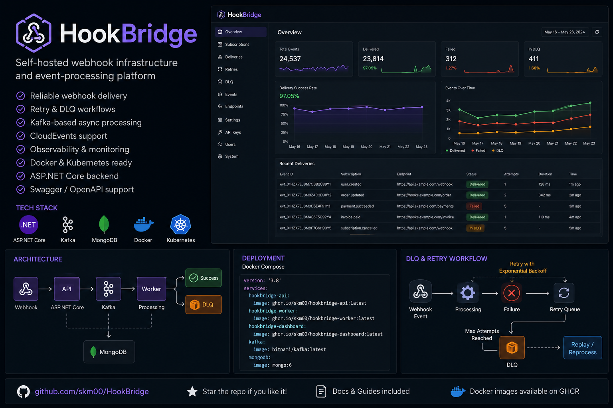
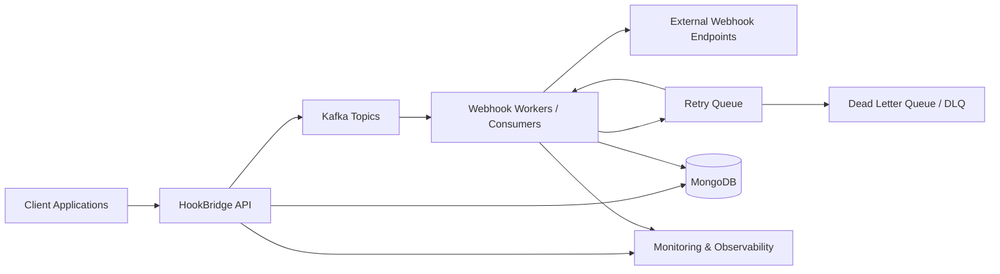

# HookBridge

HookBridge is a self-hosted webhook infrastructure and event-processing platform for teams that need reliable delivery, retries, DLQs, and auditable event flows.
It combines ASP.NET Core, Kafka, MongoDB, Docker, and Kubernetes-oriented deployment patterns so you can operate webhook delivery without handing event data to a third-party SaaS.

[](https://github.com/skm00/HookBridge/actions/workflows/dev.yml)
[](#license)
[](.github/SECURITY.md)
[](https://github.com/sponsors/skm00)
[](https://github.com/skm00/HookBridge/discussions)
[](https://dotnet.microsoft.com/)
[](https://www.docker.com/)
[](https://kafka.apache.org/)
[](https://cloudevents.io/)



## Table of Contents

- [Why HookBridge](#why-hookbridge)
- [Features](#features)
- [Repository Layout](#repository-layout)
- [Docker Images](#docker-images)
- [Quick Start](#quick-start)
- [Local Development (.NET 8)](#local-development-net-8)
- [Kafka Consumer Swap Buffer Strategy](#kafka-consumer-swap-buffer-strategy)
- [Architecture](#architecture)
- [Screenshots](#screenshots)
- [API Documentation](#api-documentation)
- [Important Project-Specific Setup Details](#important-project-specific-setup-details)
- [Roadmap](#roadmap)
- [Community & Support](#community--support)
- [Contributing](#contributing)
- [Sponsorship](#sponsorship)
- [License](#license)

## Why HookBridge

HookBridge is intended for developers and companies that want a practical, inspectable foundation for webhook ingestion, asynchronous processing, delivery attempts, retries, and failed-event recovery. The project is designed around common production concerns: tenant isolation, endpoint validation, API keys, structured logs, health checks, observability, and self-hosted deployment.

It is not positioned as a hosted webhook SaaS. It is an open-source codebase you can run locally, adapt, harden, and deploy in your own environment.

## Features

| Area                 | Capability                                                                               | Notes                                                                                                                  |
| -------------------- | ---------------------------------------------------------------------------------------- | ---------------------------------------------------------------------------------------------------------------------- |
| Webhook ingestion    | Raw JSON, HookBridge envelopes, and CloudEvents-style payloads                           | Supports CloudEvents v1.0 structured and binary-style inputs.                                                          |
| Delivery reliability | Async worker delivery, retry handling, and failed-event/DLQ records                      | Worker consumes Kafka event streams and records delivery outcomes.                                                      |
| Event processing     | Kafka-based event and retry consumers                                                    | Local Docker Compose includes Kafka and Zookeeper.                                                                     |
| Persistence          | MongoDB-backed tenants, events, subscriptions, attempts, audit logs, and notifications   | Local development defaults to the `hookbridge` database.                                                               |
| Endpoint validation  | Target URL, authentication, header, payload, and security validations                     | Designed to reduce unsafe outbound webhook configuration.                                                              |
| API security         | Admin JWT authentication, tenant API keys, roles, IP allowlists, and rate limiting       | Admin APIs use Bearer tokens; event ingestion uses `x-api-key`.                                                        |
| Observability        | Health checks, structured logging, Elasticsearch, Kibana, and Elastic APM support        | Compose includes Elasticsearch, Kibana, and APM Server.                                                                |
| Dashboard            | React dashboard and public documentation/marketing routes                                | Dashboard runs on port `3000` in Docker Compose.                                                                      |
| Deployment           | Docker Compose and Helm/Kubernetes deployment assets                                     | See [`deploy/docker-compose.yml`](deploy/docker-compose.yml) and [`deploy/helm/README.md`](deploy/helm/README.md).    |

## Repository Layout

```text
src/
  HookBridge.Api/             ASP.NET Core API, Swagger/OpenAPI, auth, ingestion, admin endpoints
  HookBridge.Application/     Application services, validation, DTOs, use cases
  HookBridge.Domain/          Domain entities and enums
  HookBridge.Infrastructure/  MongoDB, Kafka, persistence, logging, external integrations
  HookBridge.Shared/          Shared API contracts and helpers
  HookBridge.Worker/          Kafka consumers, delivery worker, retry worker, cleanup worker
  HookBridge.Dashboard/       React dashboard

tests/                        API, application, and worker test projects
deploy/                       Docker Compose, environment samples, Helm chart
docs/                         API examples, demo guide, deployment, security, backup/restore
```

## Docker Images

HookBridge packages are published on GitHub Container Registry (GHCR). Available container images:

| Component | Image |
| --- | --- |
| API | `ghcr.io/skm00/hookbridge-api:latest` |
| Worker | `ghcr.io/skm00/hookbridge-worker:latest` |
| Dashboard | `ghcr.io/skm00/hookbridge-dashboard:latest` |

## Quick Start

The fastest way to run the full local stack is Docker Compose. It starts MongoDB, Kafka, Elasticsearch, Kibana, Elastic APM, the API, the worker, and the dashboard.

### Prerequisites

- Docker and Docker Compose v2
- Git

### Start the stack

```bash
git clone https://github.com/skm00/HookBridge.git
cd HookBridge
docker compose -f deploy/docker-compose.yml up --build
```

### Local service URLs

| Service | URL |
| --- | --- |
| API | <http://localhost:5000> |
| Swagger UI | <http://localhost:5000/swagger> |
| Dashboard | <http://localhost:3000> |
| MongoDB | `mongodb://localhost:27017` |
| Kafka | `localhost:9092` |
| Elasticsearch | <http://localhost:9200> |
| Kibana | <http://localhost:5601> |
| Elastic APM Server | <http://localhost:8200> |

### Demo data

Development configuration enables demo seed data by default:

- Admin email: `demo@hookbridge.local`
- Admin password: `DemoPassword123!`
- Demo tenant slug: `demo-company`

For a guided walkthrough with sample requests and DLQ/retry scenarios, see:

- [`docs/demo.md`](docs/demo.md)
- [`docs/api-examples.md`](docs/api-examples.md)
- [`docs/postman/hookbridge.postman_collection.json`](docs/postman/hookbridge.postman_collection.json)
- [`docs/thunder-client/hookbridge.json`](docs/thunder-client/hookbridge.json)

### Stop the stack

```bash
docker compose -f deploy/docker-compose.yml down
```

To remove local MongoDB and Elasticsearch volumes as well:

```bash
docker compose -f deploy/docker-compose.yml down -v
```

## Local Development (.NET 8)

### Prerequisites

- [.NET 8 SDK](https://dotnet.microsoft.com/download/dotnet/8.0)
- Docker Compose v2 for MongoDB, Kafka, and optional observability services
- Node.js 18+ if you are working on the React dashboard

### Restore, build, and test

```bash
dotnet restore
dotnet build HookBridge.sln
dotnet test HookBridge.sln
```

### Start local infrastructure only

Use Docker Compose for dependencies and then run the API/worker from your IDE or terminal:

```bash
docker compose -f deploy/docker-compose.yml up mongodb zookeeper kafka elasticsearch kibana apm-server
```

The development settings expect:

- MongoDB: `mongodb://localhost:27017`
- Database: `hookbridge`
- Kafka: `localhost:9092` or `127.0.0.1:9092`
- Elasticsearch: `http://localhost:9200`
- Elastic APM: `http://localhost:8200`

### Run the API

```bash
dotnet run --project src/HookBridge.Api/HookBridge.Api.csproj
```

The API launch profile uses `http://localhost:52865`, while Docker Compose exposes the API on `http://localhost:5000`. Swagger is enabled in development.

### Run the worker

```bash
dotnet run --project src/HookBridge.Worker/HookBridge.Worker.csproj
```

The worker hosts:

- Swap-buffer Kafka consumer for high-throughput webhook event persistence
- Webhook retry consumer
- Automated data cleanup worker

### Run the dashboard

```bash
cd src/HookBridge.Dashboard
npm install
npm run dev
```

The Docker image serves the dashboard on `http://localhost:3000`. The Vite development server normally runs on `http://localhost:5173`.


## Kafka Consumer Swap Buffer Strategy

HookBridge's worker includes a production-oriented swap-buffer Kafka consumer for high-throughput webhook ingestion. It is designed for traffic bursts where Kafka messages must be consumed quickly while MongoDB writes are persisted in efficient batches for webhook audit logs, delivery history, retry queue persistence, DLQ event storage, and observability ingestion.

The consumer keeps the Kafka polling path lightweight by appending each deserialized `WebhookEvent` to an in-memory primary buffer. When the batch size reaches 500 records, the flush interval reaches 5 seconds, or the worker shuts down, the primary and secondary buffers are swapped under a short lock. MongoDB persistence then runs against the swapped batch so Kafka consumption can continue without awaiting every database write.

MongoDB writes use unordered `InsertManyAsync` batches with a unique `EventId` index. The unordered batch lets MongoDB continue inserting valid records when one replayed event hits a duplicate key, while the unique `EventId` requirement makes Kafka at-least-once delivery duplicate-safe.

Kafka auto commit is disabled. The worker commits offsets only after MongoDB persistence succeeds, and it commits the highest processed offset per topic partition. If MongoDB fails, offsets are not committed, allowing Kafka to replay the records. If MongoDB succeeds but the offset commit fails, replayed messages are ignored safely by the unique `EventId` constraint.

Backpressure is handled without Channels or `BlockingCollection`: if MongoDB is still flushing and the active primary buffer reaches `MaxBufferSize`, the worker pauses assigned Kafka partitions and resumes them after the flush completes.

## Architecture

HookBridge separates ingestion, event streaming, worker delivery, retry/DLQ handling, persistence, and observability concerns.



For more details, see [Architecture Documentation](docs/architecture.md).

## Screenshots

Dashboard screenshots can be added under `docs/images/` as the UI stabilizes.

## API Documentation

HookBridge publishes Swagger/OpenAPI documentation in development:

- Swagger UI: <http://localhost:5000/swagger>
- OpenAPI JSON: <http://localhost:5000/swagger/v1/swagger.json>

Swagger includes versioned API documentation and auth schemes for:

- Bearer JWT admin APIs under `/api/v1/admin/...`
- Tenant event ingestion with `x-api-key`
- Public auth, billing webhook, and health endpoints

You can export the OpenAPI document locally:

```bash
curl http://localhost:5000/swagger/v1/swagger.json -o swagger.v1.json
```

Additional API examples are available in [`docs/api.md`](docs/api.md) and [`docs/api-examples.md`](docs/api-examples.md).

## Important Project-Specific Setup Details

This section preserves operational details that are useful when running or extending HookBridge.

### API versioning

- Current stable version: `v1`
- Route format: `/api/v{version}/...`
- Examples:
  - `/api/v1/events/{tenantId}`
  - `/api/v1/admin/subscriptions`
  - `/api/v1/admin/failed-events/{id}/retry`

### Event ingestion formats

HookBridge supports multiple input styles:

```json
{ "username": "abc" }
```

```json
{
  "eventType": "invoice.created",
  "payload": { "invoiceId": "INV-001" }
}
```

```json
{
  "specversion": "1.0",
  "id": "evt_123",
  "source": "/example",
  "type": "invoice.created",
  "data": { "invoiceId": "INV-001" }
}
```

For CloudEvents binary-style requests, provide attributes such as `ce-specversion`, `ce-id`, `ce-source`, `ce-type`, and optional `ce-time` as HTTP headers. `CloudEvents.type` maps to the HookBridge event type. If no event type is present, HookBridge uses `default`. Subscription matching supports exact event types, `*`, and empty event type values as wildcards.

Strict CloudEvents validation can be enabled with configuration:

```bash
CloudEvents__StrictValidation=true
```

### Authentication model

- Admin APIs use Bearer JWTs.
- Event ingestion uses the tenant API key header: `x-api-key`.
- Admin roles include Owner, Admin, Developer, and Viewer.
- API keys can be restricted by exact IP addresses or CIDR ranges.

Example ingestion request:

```bash
curl -X POST http://localhost:5000/api/v1/events/{tenantId} \
  -H "Content-Type: application/json" \
  -H "x-api-key: {tenant-api-key}" \
  -d '{"eventType":"invoice.created","payload":{"invoiceId":"INV-001"}}'
```

### Endpoint validation and outbound authentication

Subscription endpoints support validation for:

- HTTP/HTTPS target URLs
- Development-only private network URL allowances
- Reserved or unsafe headers
- Authentication configuration
- Payload and response-size limits

Outbound webhook authentication options include:

- Basic authentication
- API key header
- OAuth2 client credentials
- HMAC signatures

### Reliability and DLQ behavior

- Events are accepted through the API and published for worker processing.
- The worker records delivery attempts, response status, duration, target URL, and errors.
- Retry policies can be fixed or exponential depending on subscription configuration.
- Failed events are recorded in the DLQ-style failed-events collection after retry exhaustion.
- Admin APIs and dashboard pages support failed-event inspection and manual retry.

### Observability and health

Local Docker Compose includes Elasticsearch, Kibana, and Elastic APM. Application settings also support disabling Elasticsearch sink or APM locally while still using structured logs and health endpoints.

Useful local endpoints:

- `/health`
- `/api/v1/health/*`
- Kibana: <http://localhost:5601>

### Configuration validation

HookBridge fails fast for critical production configuration. Production deployments should provide, at minimum:

- MongoDB connection string and database name
- Kafka bootstrap servers and consumer group settings
- JWT issuer, audience, secret, and expiry
- Stripe billing secrets and price IDs if billing is enabled
- Elastic service metadata and URLs when Elastic sinks/APM are enabled
- Encryption master key of at least 32 characters

Development allows empty Stripe secrets so the local API can start without a billing account. `Stripe:SuccessUrl` and `Stripe:CancelUrl` are still required.

### Data retention and cleanup

Development defaults include automated cleanup windows for incoming events, delivery logs, failed events, audit logs, and notifications. The worker hosts the cleanup job, so run the worker when testing retention behavior.

### Rate limiting

Development rate limits are enabled by default:

- Event ingestion: 100 requests per 60 seconds
- Admin API: 300 requests per 60 seconds

Rate limits are partitioned by relevant caller context and return standard throttling responses when exceeded.

### Dashboard routes

Public routes include:

- `/`
- `/pricing`
- `/docs`
- `/docs/quickstart`
- `/docs/events`
- `/docs/subscriptions`
- `/docs/authentication`
- `/docs/retries`
- `/docs/errors`
- `/login`
- `/register`

Protected dashboard routes include `/overview` and operational pages for tenants, subscriptions, events, delivery logs, billing, settings, health, audit logs, notifications, and failed events.

### Deployment and operations references

- Docker Compose: [`deploy/docker-compose.yml`](deploy/docker-compose.yml)
- Environment sample: [`deploy/.env.example`](deploy/.env.example)
- Helm chart: [`deploy/helm/README.md`](deploy/helm/README.md)
- Deployment notes: [`docs/deployment.md`](docs/deployment.md)
- Security notes: [`docs/security.md`](docs/security.md)
- Backup and restore: [`docs/backup-restore.md`](docs/backup-restore.md)

## Roadmap

Near-term roadmap items:

- Harden Kafka topic management and retry/DLQ operational tooling.
- Expand OpenAPI examples and SDK/client generation guidance.
- Add more deployment documentation for Kubernetes, ingress, TLS, secrets, and production observability.
- Improve dashboard workflows for delivery history, endpoint validation, and DLQ replay.
- Add more integration tests around Kafka, MongoDB, worker retry behavior, and CloudEvents compatibility.
- Document production sizing and operational runbooks.

The roadmap is intentionally conservative and implementation-driven. Issues and pull requests should prefer small, verifiable improvements over broad rewrites.

## Community & Support

HookBridge uses GitHub's public collaboration tools for community support, project coordination, and maintainer contact. GitHub does not provide a direct private DM system for repository maintainers, so please use the public channels below unless a maintainer lists another contact method on their profile.

- **Issues:** Use GitHub Issues for reproducible bugs, focused feature requests, documentation gaps, and actionable maintenance tasks. Search existing issues first, include reproduction steps or acceptance criteria, and avoid posting secrets, API keys, JWTs, connection strings, or private customer data.
- **Discussions:** Use GitHub Discussions for architecture questions, deployment tradeoffs, community support, and ideas that need design feedback before they become implementation issues.
- **Sponsorship:** HookBridge is actively maintained and community support, feedback, and sponsorships help improve long-term development. Sponsorship is optional and available through [GitHub Sponsors](https://github.com/sponsors/skm00). Avoid opening sponsorship issues unless there is a specific repository maintenance need that cannot be handled through GitHub Sponsors or maintainer profile links.
- **Contributions:** Contributions are welcome through focused pull requests with documentation and tests where practical. See [Contributing](#contributing) and [`CONTRIBUTING.md`](CONTRIBUTING.md) for workflow and maintainer-contact guidance.
- **Security reporting:** Do not report vulnerabilities in public issues or discussions. Review [`docs/security.md`](docs/security.md); if a private reporting path is not listed, use public maintainer profile links to identify an appropriate contact method without disclosing sensitive details publicly.

Maintainers can be contacted through GitHub Issues, GitHub Discussions, public profile links listed on maintainer profiles, and sponsorship pages where available. Use `@mentions` sparingly when a maintainer or contributor is directly relevant to the topic. For more support details, see [`.github/SUPPORT.md`](.github/SUPPORT.md).

## Contributing

Contributions are welcome. Please keep changes focused, documented, and covered by tests where possible.

Recommended workflow:

1. Fork the repository and create a feature branch.
2. Run `dotnet restore`, `dotnet build HookBridge.sln`, and `dotnet test HookBridge.sln` before opening a pull request.
3. For dashboard changes, run `npm install`, `npm run typecheck`, and `npm run build` from `src/HookBridge.Dashboard`.
4. Update README/docs when behavior, configuration, APIs, or deployment steps change.
5. Keep pull requests small enough to review comfortably.

Good first contribution areas include documentation fixes, test coverage, API examples, dashboard usability improvements, deployment notes, and validation edge cases.

## Sponsorship

HookBridge is actively maintained and community support, feedback, and sponsorships help improve long-term development. Sponsorship helps fund documentation, CI reliability, test coverage, dependency maintenance, demos, and long-term issue triage.

[Sponsor HookBridge on GitHub](https://github.com/sponsors/skm00)

For sponsorship messaging and maintainer notes, see [`docs/sponsorship.md`](docs/sponsorship.md).

## License

A license file has not been committed yet. Before using HookBridge in production or redistributing modified versions, confirm the intended license with the project maintainer or add an explicit license file to the repository.
