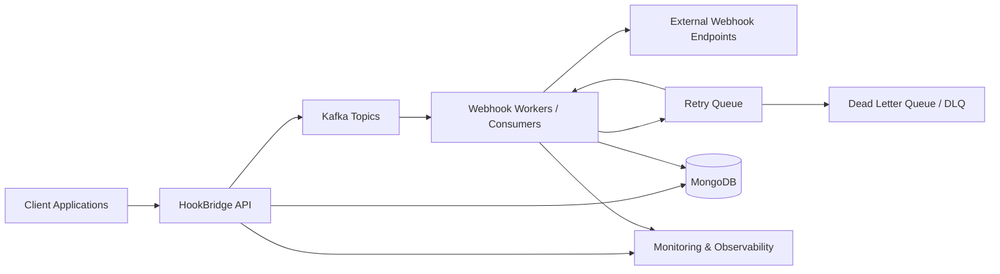

# HookBridge Architecture

HookBridge is a self-hosted webhook infrastructure and event-processing platform built around API-based ingestion, Kafka-backed event distribution, worker-driven delivery, persistent audit records, retry/DLQ handling, and operational observability.

## Architecture Diagram

## Flow Summary

1. Client applications submit webhook events to the HookBridge API.
2. The API validates tenant access, authentication, payload shape, rate limits, and endpoint configuration.
3. Accepted events are persisted in MongoDB and published to Kafka topics.
4. Webhook workers and consumers process Kafka topic messages and deliver webhook requests to external webhook endpoints.
5. Failed delivery attempts move from webhook workers to the retry queue, where they can be retried by workers.
6. Events that cannot be successfully delivered after retry handling move from the retry queue to the Dead Letter Queue (DLQ) for inspection and remediation.
7. MongoDB stores tenants, events, delivery attempts, audit records, and failed-event state written by both the API and workers.
8. Monitoring and observability tooling receives operational signals from both the HookBridge API and webhook workers.
