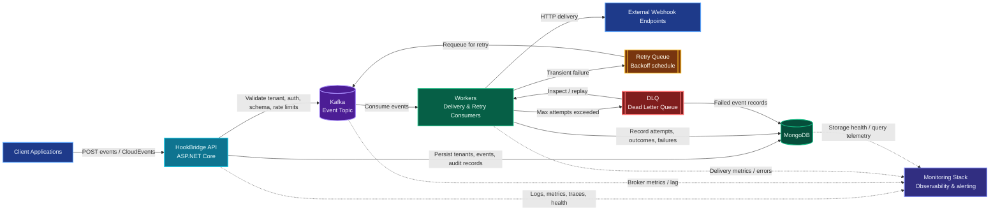

# HookBridge Architecture

HookBridge is a self-hosted webhook infrastructure and event-processing platform built around API-based ingestion, Kafka-backed event distribution, worker-driven delivery, persistent audit records, retry/DLQ handling, and operational observability.

## Flow Summary

1. Client applications submit webhook events to the HookBridge API.
2. The API validates tenant access, authentication, payload shape, rate limits, and endpoint configuration.
3. Accepted events are persisted and published to Kafka.
4. Worker consumers process Kafka events and deliver webhook requests to external endpoints.
5. Transient delivery failures move through the retry queue with backoff before being reprocessed.
6. Exhausted events are placed in the DLQ for inspection, audit, and replay workflows.
7. MongoDB stores tenants, events, delivery attempts, audit records, and failed-event state.
8. The monitoring stack observes API health, Kafka lag, worker errors, delivery metrics, and storage health.
